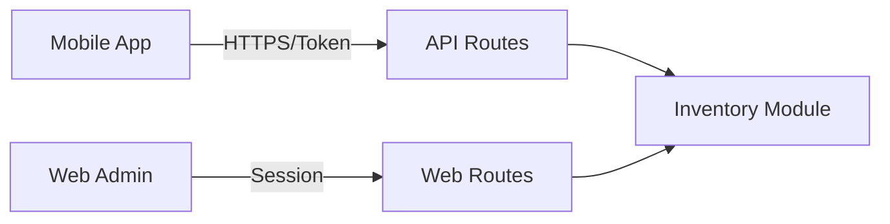
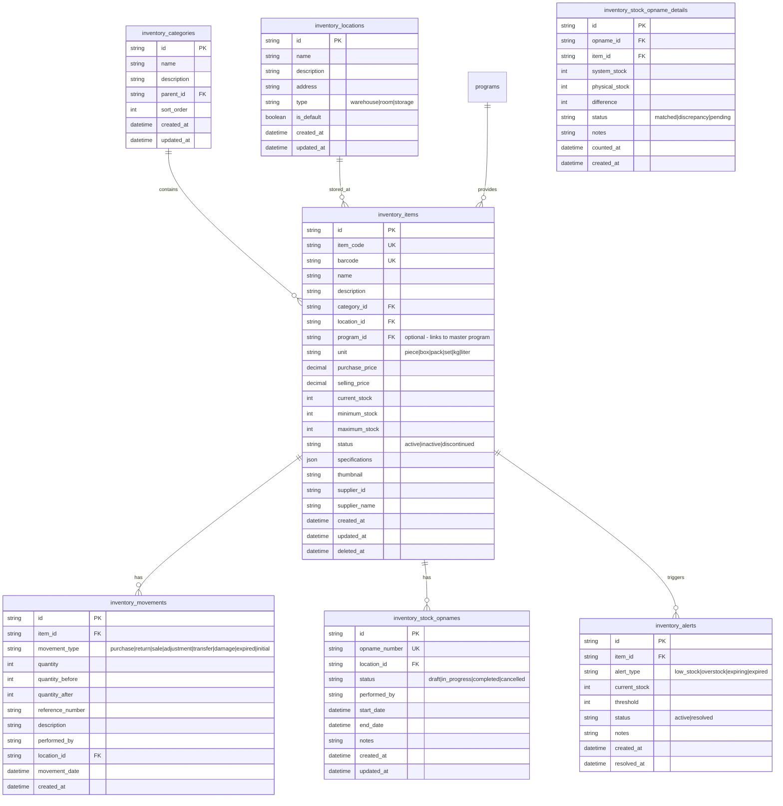

# Inventory Module Specification

## 0. Module Design Principles

This module follows a **fully independent architecture** with:

- **Standalone Layouts**: Custom layout files specific to Inventory module
- **Dedicated Menus**: Self-contained menu configuration
- **Full API Coverage**: RESTful API endpoints for all features (mobile app ready)
- **Token Authentication**: All API routes protected with token-based auth

### API Architecture



---

This document outlines the comprehensive architecture for the **Inventory Module** in SOSCT. The module is designed to manage inventory items (books, electronics, furniture, etc.) with full stock tracking capabilities including master data management, stock opname (physical inventory counting), stock movements, low stock alerts, and barcode/QR code support.

### 1.1 Module Components

| Component              | Description                                                                           |
| ---------------------- | ------------------------------------------------------------------------------------- |
| **Inventory Master**   | Store item details (name, category, SKU, barcode, price, supplier, location, program) |
| **Stock Opname**       | Record physical stock counts and reconcile with system quantities                     |
| **Stock Movements**    | Track all additions and reductions of inventory                                       |
| **Low Stock Alerts**   | Notify when items fall below minimum threshold                                        |
| **Barcode/QR Support** | Generate and scan barcodes/QR codes for item identification                           |

### 1.2 API-First Design

All features are available via both **Web UI** and **RESTful API**:

| Feature      | Web Routes                  | API Routes                      | Authentication  |
| ------------ | --------------------------- | ------------------------------- | --------------- |
| Items CRUD   | `/inventory/items/*`        | `/api/inventory/items/*`        | Session / Token |
| Categories   | `/inventory/categories/*`   | `/api/inventory/categories/*`   | Session / Token |
| Locations    | `/inventory/locations/*`    | `/api/inventory/locations/*`    | Session / Token |
| Movements    | `/inventory/movements/*`    | `/api/inventory/movements/*`    | Session / Token |
| Stock Opname | `/inventory/stock-opname/*` | `/api/inventory/stock-opname/*` | Session / Token |
| Alerts       | `/inventory/alerts/*`       | `/api/inventory/alerts/*`       | Session / Token |
| Reports      | `/inventory/reports/*`      | `/api/inventory/reports/*`      | Session / Token |

### 1.3 Standalone Layouts

The module uses its own layout files for complete independence:

```
app/Modules/Inventory/
├── Views/
│   ├── layouts/
│   │   ├── inventory_layout.php     # Main layout with sidebar
│   │   └── modal_layout.php         # For modal-based operations
│   └── ... (feature views)
```

**Layout Features:**

- Custom sidebar with Inventory-specific menu
- Breadcrumb navigation
- Module-specific CSS/JS assets
- Responsive design

---

## 2. Database Schema

### 2.1 Tables Overview



### 2.2 Field Definitions

#### inventory_categories

| Field       | Type         | Description                       |
| ----------- | ------------ | --------------------------------- |
| id          | CHAR(36)     | Primary key (UUID)                |
| name        | VARCHAR(255) | Category name                     |
| description | TEXT         | Category description              |
| parent_id   | CHAR(36)     | Parent category for subcategories |
| sort_order  | INT          | Display order                     |
| created_at  | DATETIME     | Creation timestamp                |
| updated_at  | DATETIME     | Update timestamp                  |

#### inventory_locations

| Field       | Type         | Description                    |
| ----------- | ------------ | ------------------------------ |
| id          | CHAR(36)     | Primary key (UUID)             |
| name        | VARCHAR(255) | Location name                  |
| description | TEXT         | Location description           |
| address     | VARCHAR(500) | Physical address               |
| type        | ENUM         | warehouse, room, storage       |
| is_default  | BOOLEAN      | Default location for new items |
| created_at  | DATETIME     | Creation timestamp             |
| updated_at  | DATETIME     | Update timestamp               |

#### inventory_items

| Field          | Type          | Description                                                  |
| -------------- | ------------- | ------------------------------------------------------------ |
| id             | CHAR(36)      | Primary key (UUID)                                           |
| item_code      | VARCHAR(50)   | Unique internal item code                                    |
| barcode        | VARCHAR(100)  | Barcode/QR code value                                        |
| name           | VARCHAR(255)  | Item name                                                    |
| description    | TEXT          | Item description                                             |
| category_id    | CHAR(36)      | Foreign key to categories                                    |
| location_id    | CHAR(36)      | Foreign key to locations                                     |
| program_id     | CHAR(36)      | Foreign key to programs (optional - links to master program) |
| unit           | VARCHAR(20)   | Unit of measurement                                          |
| purchase_price | DECIMAL(12,2) | Purchase cost                                                |
| selling_price  | DECIMAL(12,2) | Selling price                                                |
| current_stock  | INT           | Current quantity in stock                                    |
| minimum_stock  | INT           | Minimum stock threshold                                      |
| maximum_stock  | INT           | Maximum stock threshold                                      |
| status         | ENUM          | active, inactive, discontinued                               |
| specifications | JSON          | Additional specifications                                    |
| thumbnail      | VARCHAR(255)  | Item image path (stored in /uploads/inventory/)              |
| supplier_id    | VARCHAR(50)   | Supplier reference                                           |
| supplier_name  | VARCHAR(255)  | Supplier name                                                |
| created_at     | DATETIME      | Creation timestamp                                           |
| updated_at     | DATETIME      | Update timestamp                                             |
| deleted_at     | DATETIME      | Soft delete timestamp                                        |

#### inventory_movements

| Field            | Type         | Description                                                            |
| ---------------- | ------------ | ---------------------------------------------------------------------- |
| id               | CHAR(36)     | Primary key (UUID)                                                     |
| item_id          | CHAR(36)     | Foreign key to items                                                   |
| movement_type    | ENUM         | purchase, return, sale, adjustment, transfer, damage, expired, initial |
| quantity         | INT          | Quantity changed                                                       |
| quantity_before  | INT          | Stock before movement                                                  |
| quantity_after   | INT          | Stock after movement                                                   |
| reference_number | VARCHAR(100) | External reference                                                     |
| description      | TEXT         | Movement description                                                   |
| performed_by     | VARCHAR(255) | User who performed                                                     |
| location_id      | CHAR(36)     | Foreign key to locations                                               |
| movement_date    | DATETIME     | Date of movement                                                       |
| created_at       | DATETIME     | Creation timestamp                                                     |

#### inventory_stock_opnames

| Field         | Type         | Description                              |
| ------------- | ------------ | ---------------------------------------- |
| id            | CHAR(36)     | Primary key (UUID)                       |
| opname_number | VARCHAR(50)  | Unique opname number                     |
| location_id   | CHAR(36)     | Foreign key to locations                 |
| status        | ENUM         | draft, in_progress, completed, cancelled |
| performed_by  | VARCHAR(255) | User who performed                       |
| start_date    | DATETIME     | Opname start date                        |
| end_date      | DATETIME     | Opname end date                          |
| notes         | TEXT         | Additional notes                         |
| created_at    | DATETIME     | Creation timestamp                       |
| updated_at    | DATETIME     | Update timestamp                         |

#### inventory_stock_opname_details

| Field          | Type     | Description                    |
| -------------- | -------- | ------------------------------ |
| id             | CHAR(36) | Primary key (UUID)             |
| opname_id      | CHAR(36) | Foreign key to stock_opnames   |
| item_id        | CHAR(36) | Foreign key to items           |
| system_stock   | INT      | System recorded stock          |
| physical_stock | INT      | Physically counted stock       |
| difference     | INT      | Difference (physical - system) |
| status         | ENUM     | matched, discrepancy, pending  |
| notes          | TEXT     | Counting notes                 |
| counted_at     | DATETIME | Count timestamp                |
| created_at     | DATETIME | Creation timestamp             |

#### inventory_alerts

| Field         | Type     | Description                             |
| ------------- | -------- | --------------------------------------- |
| id            | CHAR(36) | Primary key (UUID)                      |
| item_id       | CHAR(36) | Foreign key to items                    |
| alert_type    | ENUM     | low_stock, overstock, expiring, expired |
| current_stock | INT      | Stock at alert time                     |
| threshold     | INT      | Threshold that triggered                |
| status        | ENUM     | active, resolved                        |
| notes         | TEXT     | Alert notes                             |
| created_at    | DATETIME | Creation timestamp                      |
| resolved_at   | DATETIME | Resolution timestamp                    |

---

## 3. Module Structure

### 3.1 Directory Structure

```
app/Modules/Inventory/
├── Config/
│   ├── Menu.php              # Menu configuration
│   └── Routes.php            # Route definitions
├── Controllers/
│   ├── CategoryController.php
│   ├── LocationController.php
│   ├── ItemController.php
│   ├── MovementController.php
│   ├── StockOpnameController.php
│   ├── AlertController.php
│   └── ReportController.php
├── Controllers/Api/
│   ├── CategoryApiController.php
│   ├── LocationApiController.php
│   ├── ItemApiController.php
│   ├── MovementApiController.php
│   ├── StockOpnameApiController.php
│   └── AlertApiController.php
├── Models/
│   ├── CategoryModel.php
│   ├── LocationModel.php
│   ├── ItemModel.php
│   ├── MovementModel.php
│   ├── StockOpnameModel.php
│   ├── StockOpnameDetailModel.php
│   └── AlertModel.php
├── Views/
│   ├── categories/
│   │   ├── index.php
│   │   ├── create.php
│   │   └── edit.php
│   ├── locations/
│   │   ├── index.php
│   │   ├── create.php
│   │   └── edit.php
│   ├── items/
│   │   ├── index.php
│   │   ├── create.php
│   │   ├── edit.php
│   │   ├── view.php
│   │   └── barcode.php
│   ├── movements/
│   │   ├── index.php
│   │   ├── create.php
│   │   └── report.php
│   ├── stock-opname/
│   │   ├── index.php
│   │   ├── create.php
│   │   ├── detail.php
│   │   └── result.php
│   ├── alerts/
│   │   ├── index.php
│   │   └── resolve.php
│   ├── reports/
│   │   ├── summary.php
│   │   ├── valuation.php
│   │   └── movement.php
│   └── layouts/
│       ├── inventory_layout.php    # Main layout with sidebar
│       └── modal_layout.php         # For modal-based operations
└── Libraries/
    └── BarcodeGenerator.php
```

---

## 4. Features Specification

### 4.1 Inventory Master (Items)

| Feature            | Description                                                            |
| ------------------ | ---------------------------------------------------------------------- |
| CRUD Operations    | Create, Read, Update, Delete inventory items                           |
| Categories         | Hierarchical category management (Books, Electronics, Furniture, etc.) |
| Locations          | Multiple storage locations support                                     |
| Program Link       | Link items to Master Programs (for program materials, books, etc.)     |
| Barcode Generation | Auto-generate QR codes for items                                       |
| Image Upload       | Item thumbnail management (stored in /uploads/inventory/)              |
| Search & Filter    | Advanced search by name, code, category, location, program             |
| Bulk Import        | Import items from CSV                                                  |
| Specifications     | JSON field for custom attributes                                       |

### 4.2 Stock Opname

| Feature               | Description                                       |
| --------------------- | ------------------------------------------------- |
| Create Opname Session | Start new stock opname for a location             |
| Item Listing          | List all items at a location                      |
| Physical Count        | Enter physical count for each item                |
| Discrepancy Detection | Highlight differences between system and physical |
| Adjustment            | Auto-create stock movement to reconcile           |
| Reports               | Generate opname reports                           |
| History               | View past opname sessions                         |

### 4.3 Stock Movements

| Feature           | Description                                                            |
| ----------------- | ---------------------------------------------------------------------- |
| Movement Types    | purchase, return, sale, adjustment, transfer, damage, expired, initial |
| Reference Numbers | Link to external documents                                             |
| Location Transfer | Move items between locations                                           |
| Movement History  | Full audit trail of all changes                                        |
| Reports           | Movement reports by date range, type, item                             |

### 4.4 Low Stock Alerts

| Feature                 | Description                                         |
| ----------------------- | --------------------------------------------------- |
| Auto-Detection          | Automatically detect when stock falls below minimum |
| Alert Types             | low_stock, overstock, expiring, expired             |
| Dashboard Widget        | Show active alerts on dashboard                     |
| Resolution Tracking     | Track alert status and resolution                   |
| Configurable Thresholds | Set minimum/maximum per item                        |

### 4.5 Barcode/QR Support

| Feature            | Description                           |
| ------------------ | ------------------------------------- |
| QR Code Generation | Generate QR codes for items           |
| Barcode Display    | Show barcode on item cards and labels |
| Print Labels       | Print item labels with barcode        |
| QR Code Lookup     | Scan/search by barcode                |

---

## 5. Routes

### 5.1 Web Routes

| Method | URL                                         | Controller::Method                 | Description       |
| ------ | ------------------------------------------- | ---------------------------------- | ----------------- |
| GET    | /inventory                                  | ItemController::index              | Item list         |
| GET    | /inventory/items                            | ItemController::index              | Item list         |
| GET    | /inventory/items/create                     | ItemController::create             | Create item form  |
| POST   | /inventory/items/store                      | ItemController::store              | Store new item    |
| GET    | /inventory/items/edit/(:segment)            | ItemController::edit/$1            | Edit item form    |
| POST   | /inventory/items/update/(:segment)          | ItemController::update/$1          | Update item       |
| GET    | /inventory/items/view/(:segment)            | ItemController::view/$1            | View item details |
| GET    | /inventory/items/barcode/(:segment)         | ItemController::barcode/$1         | Generate barcode  |
| POST   | /inventory/items/delete/(:segment)          | ItemController::delete/$1          | Delete item       |
| GET    | /inventory/categories                       | CategoryController::index          | Category list     |
| POST   | /inventory/categories/store                 | CategoryController::store          | Create category   |
| GET    | /inventory/locations                        | LocationController::index          | Location list     |
| POST   | /inventory/locations/store                  | LocationController::store          | Create location   |
| GET    | /inventory/movements                        | MovementController::index          | Movement list     |
| POST   | /inventory/movements/store                  | MovementController::store          | Create movement   |
| GET    | /inventory/stock-opname                     | StockOpnameController::index       | Opname list       |
| GET    | /inventory/stock-opname/create              | StockOpnameController::create      | Create opname     |
| GET    | /inventory/stock-opname/detail/(:segment)   | StockOpnameController::detail/$1   | Opname detail     |
| POST   | /inventory/stock-opname/complete/(:segment) | StockOpnameController::complete/$1 | Complete opname   |
| GET    | /inventory/alerts                           | AlertController::index             | Alert list        |
| GET    | /inventory/reports/summary                  | ReportController::summary          | Inventory summary |
| GET    | /inventory/reports/valuation                | ReportController::valuation        | Stock valuation   |

### 5.2 API Routes

| Method | URL                                            | Controller::Method                     | Description       |
| ------ | ---------------------------------------------- | -------------------------------------- | ----------------- |
| GET    | /api/inventory/items                           | ItemApiController::index               | List items        |
| POST   | /api/inventory/items                           | ItemApiController::create              | Create item       |
| GET    | /api/inventory/items/(:segment)                | ItemApiController::show/$1             | Get item          |
| PUT    | /api/inventory/items/(:segment)                | ItemApiController::update/$1           | Update item       |
| DELETE | /api/inventory/items/(:segment)                | ItemApiController::delete/$1           | Delete item       |
| GET    | /api/inventory/items/search                    | ItemApiController::search              | Search items      |
| GET    | /api/inventory/items/barcode/(:segment)        | ItemApiController::barcode/$1          | Get barcode       |
| GET    | /api/inventory/categories                      | CategoryApiController::index           | List categories   |
| GET    | /api/inventory/locations                       | LocationApiController::index           | List locations    |
| GET    | /api/inventory/movements                       | MovementApiController::index           | List movements    |
| POST   | /api/inventory/movements                       | MovementApiController::create          | Create movement   |
| GET    | /api/inventory/movements/item/(:segment)       | MovementApiController::byItem/$1       | Movements by item |
| GET    | /api/inventory/stock-opname                    | StockOpnameApiController::index        | List opnames      |
| POST   | /api/inventory/stock-opname                    | StockOpnameApiController::create       | Create opname     |
| GET    | /api/inventory/stock-opname/(:segment)         | StockOpnameApiController::show/$1      | Get opname        |
| PUT    | /api/inventory/stock-opname/(:segment)         | StockOpnameApiController::update/$1    | Update opname     |
| POST   | /api/inventory/stock-opname/(:segment)/details | StockOpnameApiController::addDetail/$1 | Add opname detail |
| GET    | /api/inventory/alerts                          | AlertApiController::index              | List alerts       |
| PUT    | /api/inventory/alerts/(:segment)/resolve       | AlertApiController::resolve/$1         | Resolve alert     |

---

## 6. Permissions

Add to `app/Config/AuthGroups.php`:

```php
// Permissions
'inventory.manage' => 'Can manage inventory (full CRUD)',
'inventory.view' => 'Can view inventory (read-only)',
'inventory.stock-opname.manage' => 'Can manage stock opname',
'inventory.movement.manage' => 'Can manage stock movements',
'inventory.alert.manage' => 'Can manage alerts',
'inventory.report.view' => 'Can view inventory reports',
```

---

## 7. Menu Configuration

```php
// In app/Modules/Inventory/Config/Menu.php
return [
    [
        'title' => 'Inventory',
        'url' => 'inventory/items',
        'icon' => 'box-seam',
        'permission' => ['inventory.manage', 'inventory.view'],
        'order' => 10,
        'category' => 'operations',
        'submenu' => [
            [
                'title' => 'Items',
                'url' => 'inventory/items',
                'icon' => 'list-ul'
            ],
            [
                'title' => 'Categories',
                'url' => 'inventory/categories',
                'icon' => 'folder'
            ],
            [
                'title' => 'Locations',
                'url' => 'inventory/locations',
                'icon' => 'geo-alt'
            ],
            [
                'title' => 'Movements',
                'url' => 'inventory/movements',
                'icon' => 'arrow-left-right'
            ],
            [
                'title' => 'Stock Opname',
                'url' => 'inventory/stock-opname',
                'icon' => 'clipboard-data'
            ],
            [
                'title' => 'Alerts',
                'url' => 'inventory/alerts',
                'icon' => 'exclamation-triangle'
            ],
            [
                'title' => 'Reports',
                'url' => 'inventory/reports/summary',
                'icon' => 'graph-up',
                'submenu' => [
                    ['title' => 'Summary', 'url' => 'inventory/reports/summary'],
                    ['title' => 'Valuation', 'url' => 'inventory/reports/valuation'],
                    ['title' => 'Movements', 'url' => 'inventory/reports/movement']
                ]
            ]
        ]
    ]
];
```

---

## 8. Implementation Priority

### Phase 1: Core Features

1. Database migrations
2. Category and Location management
3. Item CRUD (Inventory Master)
4. Basic search and filtering

### Phase 2: Stock Operations

5. Stock Movements (add/reduce stock)
6. Stock Opname workflow
7. Discrepancy handling

### Phase 3: Advanced Features

8. Low Stock Alerts
9. Barcode/QR Code generation
10. Reports and analytics

### Phase 4: Enhancements

11. Bulk import/export
12. Print labels
13. Dashboard widget

---

## 9. Integration Points

| Integration   | Description                            |
| ------------- | -------------------------------------- |
| Dashboard     | Show low stock alerts widget           |
| Notifications | Send alerts when stock is low          |
| Reports       | Include inventory in financial reports |

---

## 10. Acceptance Criteria

- [ ] Items can be created, viewed, edited, and deleted
- [ ] Categories and locations can be managed
- [ ] Stock movements accurately update item quantities
- [ ] Stock opname can be performed with discrepancy detection
- [ ] Low stock alerts are generated automatically
- [ ] QR codes can be generated for items
- [ ] Items can be linked to Master Programs
- [ ] Item images (thumbnails) can be uploaded
- [ ] All CRUD operations work via both Web UI and API
- [ ] **Module has standalone layouts** (not dependent on app-wide layouts)
- [ ] API endpoints are fully functional with token authentication
- [ ] Permissions properly restrict access
- [ ] Menu items appear correctly based on permissions
