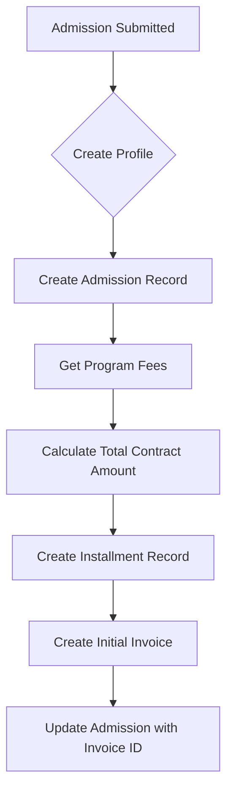
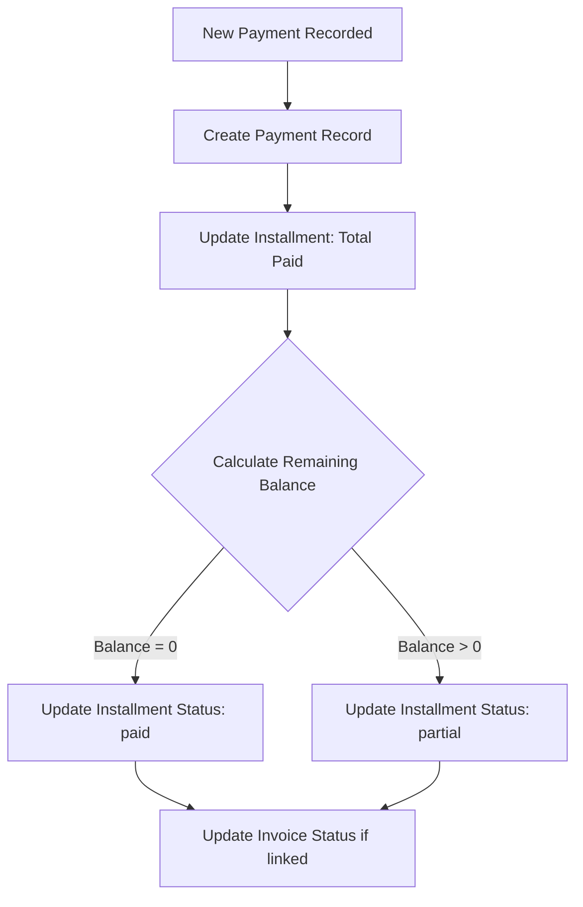

# Invoice and Installment System Refactoring Plan

## Overview

This document outlines the refactoring of the invoice and payment system to introduce an **Installments** table that tracks the total contract amount and payment status per admission, while keeping **Invoices** as issued documents for collection purposes.

## Current State Analysis

### Existing Tables

| Table        | Purpose                                         |
| ------------ | ----------------------------------------------- |
| `invoices`   | Stores all invoice records with status tracking |
| `payments`   | Records individual payments linked to invoices  |
| `admissions` | Student applications                            |

### Current Issues

1. Invoices currently track both issued documents AND payment status
2. No centralized way to track total contract amount vs. payments made
3. Difficult to show "total contract" vs "invoice amount" on documents
4. Payment status is scattered across invoice records

## Proposed Data Model

### 1. Installments Table (NEW)

Tracks the payment summary for each admission contract.

**Table Name**: `installments`

| Column                | Type                              | Constraints                                  | Description                                           |
| --------------------- | --------------------------------- | -------------------------------------------- | ----------------------------------------------------- |
| id                    | INT                               | PK, AUTO_INCREMENT                           | Primary key                                           |
| registration_number   | VARCHAR(20)                       | FK -> admissions.registration_number, UNIQUE | Student registration (also serves as contract number) |
| total_contract_amount | DECIMAL(10,2)                     | NOT NULL                                     | Total fees for the admission (registration + tuition) |
| total_paid            | DECIMAL(10,2)                     | DEFAULT 0.00                                 | Sum of all payments made                              |
| remaining_balance     | DECIMAL(10,2)                     | NOT NULL                                     | Calculated: total_contract_amount - total_paid        |
| status                | ENUM('unpaid', 'partial', 'paid') | DEFAULT 'unpaid'                             | Payment status based on balance                       |
| due_date              | DATE                              | NULL                                         | Final payment due date                                |
| created_at            | DATETIME                          | NULL                                         | Creation timestamp                                    |
| updated_at            | DATETIME                          | NULL                                         | Update timestamp                                      |

**Relationships**:

- One-to-One with [`admissions`](#3-admissions-table) via `registration_number`
- One-to-Many with [`payments`](#9-payments-table) via `registration_number`
- One-to-Many with [`invoices`](#8-invoices-table) via `registration_number`

### 2. Updated Invoices Table

**Table Name**: [`invoices`](app/Database/Migrations/2026-02-01-000001_CreateInvoicesTable.php)

**Changes**:

- Add `installment_id` column to link invoice to installment record
- Add `contract_number` column (alias for registration_number, for display purposes)
- Add `parent_invoice_id` column to link to original invoice when re-issued
- Invoice status: unpaid, paid, cancelled, expired, partially_paid, **extended** (for re-issued invoices)

| Column              | Type                                                                         | Constraints                          | Description                              |
| ------------------- | ---------------------------------------------------------------------------- | ------------------------------------ | ---------------------------------------- |
| id                  | INT                                                                          | PK, AUTO_INCREMENT                   | Primary key                              |
| invoice_number      | VARCHAR(50)                                                                  | UNIQUE                               | Invoice number                           |
| contract_number     | VARCHAR(20)                                                                  | FK -> admissions.registration_number | Registration number (for display)        |
| registration_number | VARCHAR(20)                                                                  | FK -> admissions.registration_number | Student registration                     |
| installment_id      | INT                                                                          | FK -> installments.id, NULL          | Associated installment record            |
| description         | TEXT                                                                         | NULL                                 | Invoice description                      |
| amount              | DECIMAL(10,2)                                                                | NOT NULL                             | Amount to be collected with this invoice |
| due_date            | DATE                                                                         | NOT NULL                             | Payment due date                         |
| invoice_type        | ENUM('registration_fee', 'tuition_fee', 'miscellaneous_fee')                 | NOT NULL                             | Type of invoice                          |
| status              | ENUM('unpaid', 'paid', 'cancelled', 'expired', 'partially_paid', 'extended') | DEFAULT 'unpaid'                     | Payment status                           |
| items               | JSON                                                                         | NULL                                 | Invoice line items                       |
| parent_invoice_id   | INT                                                                          | FK -> invoices.id, NULL              | Parent invoice (for splits)              |
| created_at          | DATETIME                                                                     | NULL                                 | Creation timestamp                       |
| updated_at          | DATETIME                                                                     | NULL                                 | Update timestamp                         |
| deleted_at          | DATETIME                                                                     | NULL                                 | Soft delete timestamp                    |

### 3. Updated Payments Table

**Table Name**: [`payments`](app/Database/Migrations/2026-02-01-000002_CreatePaymentsTable.php)

**Changes**:

- Add `installment_id` column to link payment to installment record

| Column              | Type                                                           | Constraints                          | Description                   |
| ------------------- | -------------------------------------------------------------- | ------------------------------------ | ----------------------------- |
| id                  | INT                                                            | PK, AUTO_INCREMENT                   | Primary key                   |
| registration_number | VARCHAR(20)                                                    | FK -> admissions.registration_number | Student registration          |
| installment_id      | INT                                                            | FK -> installments.id, NULL          | Associated installment record |
| invoice_id          | INT                                                            | FK -> invoices.id, NULL              | Associated invoice (optional) |
| amount              | DECIMAL(10,2)                                                  | NOT NULL                             | Payment amount                |
| payment_method      | ENUM('cash', 'bank_transfer', 'mobile_banking', 'credit_card') | NOT NULL                             | Payment method                |
| document_number     | VARCHAR(100)                                                   | NULL                                 | Transaction reference         |
| payment_date        | DATE                                                           | NOT NULL                             | Date of payment               |
| receipt_file        | VARCHAR(255)                                                   | NULL                                 | Receipt file path             |
| status              | ENUM('pending', 'paid', 'failed', 'refunded')                  | DEFAULT 'pending'                    | Payment status                |
| failure_reason      | TEXT                                                           | NULL                                 | Failure details               |
| refund_date         | DATE                                                           | NULL                                 | Date refunded                 |
| refund_reason       | TEXT                                                           | NULL                                 | Refund reason                 |
| notes               | TEXT                                                           | NULL                                 | Additional notes              |
| created_at          | DATETIME                                                       | NULL                                 | Creation timestamp            |
| updated_at          | DATETIME                                                       | NULL                                 | Update timestamp              |
| deleted_at          | DATETIME                                                       | NULL                                 | Soft delete timestamp         |

## Workflow

### Admission Creation Flow



### Payment Flow



## Implementation Steps

### Step 1: Create Installments Migration

Create [`app/Database/Migrations/YYYY-MM-DD-CreateInstallmentsTable.php`](app/Database/Migrations)

```php
public function up()
{
    $this->forge->addField([
        'id' => [
            'type' => 'INT',
            'constraint' => 11,
            'unsigned' => true,
            'auto_increment' => true,
        ],
        'registration_number' => [
            'type' => 'VARCHAR',
            'constraint' => 20,
        ],
        'total_contract_amount' => [
            'type' => 'DECIMAL',
            'constraint' => '10,2',
        ],
        'total_paid' => [
            'type' => 'DECIMAL',
            'constraint' => '10,2',
            'default' => 0.00,
        ],
        'remaining_balance' => [
            'type' => 'DECIMAL',
            'constraint' => '10,2',
        ],
        'status' => [
            'type' => 'ENUM',
            'constraint' => ['unpaid', 'partial', 'paid'],
            'default' => 'unpaid',
        ],
        'due_date' => [
            'type' => 'DATE',
            'null' => true,
        ],
        'created_at' => [
            'type' => 'DATETIME',
            'null' => true,
        ],
        'updated_at' => [
            'type' => 'DATETIME',
            'null' => true,
        ],
    ]);

    $this->forge->addKey('id', true);
    $this->forge->addUniqueKey('registration_number');
    $this->forge->addForeignKey('registration_number', 'admissions', 'registration_number', 'CASCADE', 'CASCADE');
    $this->forge->createTable('installments');
}
```

### Step 2: Create InstallmentModel

Create [`app/Modules/Payment/Models/InstallmentModel.php`](app/Modules/Payment/Models)

Key methods:

- `createInstallment(array $data)` - Create new installment record
- `getInstallmentByRegistration(string $regNum)` - Get installment by student
- `updatePaymentTotal(int $installmentId)` - Recalculate and update total paid
- `getBalance(int $installmentId)` - Get remaining balance
- `markAsPaid(int $installmentId)` - Mark installment as fully paid

### Step 3: Update Invoices Migration

Add columns to existing invoices table:

- `installment_id` - FK to installments
- `contract_number` - Alias for display

### Step 4: Update Payments Migration

Add column to existing payments table:

- `installment_id` - FK to installments

### Step 5: Update AdmissionController

Modify [`app/Modules/Admission/Controllers/AdmissionController.php`](app/Modules/Admission/Controllers/AdmissionController.php) `store()` method:

1. After creating admission, create installment record
2. Link initial invoice to installment
3. Store installment_id on admission record (optional)

### Step 6: Update InvoiceModel

Modify [`app/Modules/Payment/Models/InvoiceModel.php`](app/Modules/Payment/Models/InvoiceModel.php):

1. Add `installment_id` to allowedFields
2. Add validation for installment relationship
3. Update `createInvoice()` to accept installment_id
4. Add method `getInvoiceWithInstallment(int $id)`

### Step 7: Update PaymentModel

Modify [`app/Modules/Payment/Models/PaymentModel.php`](app/Modules/Payment/Models/PaymentModel.php):

1. Add `installment_id` to allowedFields
2. Update `createPayment()` to auto-link installment based on registration_number
3. Add trigger to update installment total_paid after payment creation
4. Update `updatePaymentStatus()` to recalculate installment balance

### Step 8: Update Invoice Views

Modify invoice views to display installment information:

- [`app/Modules/Payment/Views/invoices/view.php`](app/Modules/Payment/Views/invoices/view.php)
- [`app/Modules/Payment/Views/invoices/print.php`](app/Modules/Payment/Views/invoices/print.php)
- [`app/Modules/Payment/Views/invoices/create.php`](app/Modules/Payment/Views/invoices/create.php)

Display on invoice:

- Contract Number (registration_number)
- Total Contract Amount
- Total Paid (from installment)
- Remaining Balance
- This Invoice Amount

### Step 9: Update Controllers

Update controllers to work with new structure:

- [`InvoiceController.php`](app/Modules/Payment/Controllers/InvoiceController.php)
- [`PaymentController.php`](app/Modules/Payment/Controllers/PaymentController.php)
- [`StudentPaymentController.php`](app/Modules/Payment/Controllers/StudentPaymentController.php)

### Step 10: Create Data Migration Script

Create migration script to:

1. Create installments table
2. For each admission with invoices, create installment record
3. Calculate total_contract_amount from sum of all invoices
4. Calculate total_paid from sum of all payments
5. Update existing invoices with installment_id
6. Update existing payments with installment_id

## Backward Compatibility

The refactoring maintains backward compatibility:

1. Existing invoices without `installment_id` continue to work
2. Existing payments without `installment_id` continue to work
3. The `registration_number` foreign key remains on both tables
4. Old functionality can be gradually migrated

## Testing Checklist

- [ ] Admission creation auto-creates installment
- [ ] Initial invoice is linked to installment
- [ ] Payment creation updates installment total_paid
- [ ] Installment status updates correctly (unpaid -> partial -> paid)
- [ ] Invoice view shows correct installment information
- [ ] Invoice print displays contract totals correctly
- [ ] Search and filter still work on invoices
- [ ] Search and filter still work on payments
- [ ] Dashboard statistics calculate correctly
- [ ] Existing data migration works correctly

## Estimated Files to Modify

| File                                                                | Action |
| ------------------------------------------------------------------- | ------ |
| `app/Database/Migrations/YYYY-MM-DD-CreateInstallmentsTable.php`    | Create |
| `app/Database/Migrations/YYYY-MM-DD-AddInstallmentIdToInvoices.php` | Create |
| `app/Database/Migrations/YYYY-MM-DD-AddInstallmentIdToPayments.php` | Create |
| `app/Modules/Payment/Models/InstallmentModel.php`                   | Create |
| `app/Modules/Payment/Models/InvoiceModel.php`                       | Modify |
| `app/Modules/Payment/Models/PaymentModel.php`                       | Modify |
| `app/Modules/Admission/Controllers/AdmissionController.php`         | Modify |
| `app/Modules/Payment/Controllers/InvoiceController.php`             | Modify |
| `app/Modules/Payment/Controllers/PaymentController.php`             | Modify |
| `app/Modules/Payment/Views/invoices/view.php`                       | Modify |
| `app/Modules/Payment/Views/invoices/print.php`                      | Modify |
| `app/Modules/Payment/Views/invoices/create.php`                     | Modify |
| `app/Modules/Admission/Views/view.php`                              | Modify |

### Step 3: Update Installment Due Date Logic

The `due_date` for installments should be set to **at least 2 weeks from admission creation date**.

```php
// Calculate due date: 2 weeks from now
$dueDate = date('Y-m-d', strtotime('+2 weeks'));
```

This can be:

- Configurable in settings
- Adjusted manually by staff if needed

---

## Contract View

A separate contract document view will be created to display the full contract details.

**File**: `app/Modules/Payment/Views/contracts/view.php`

**Contract Display Information**:

- Contract Number (registration_number)
- Student Details (name, email, phone)
- Program Details (title, category, duration)
- Total Contract Amount
- Total Paid
- Remaining Balance
- Payment Schedule
- Terms and Conditions

**Route**: `/contract/{registration_number}`

---

## Invoice Re-Issue Workflow

When an invoice is partially paid and passes the due date, admin can re-issue a new invoice for the remaining balance.

### Process:

1. **Original Invoice**: Status changes from `partially_paid` to `extended`
2. **Link**: New invoice is linked to original via `parent_invoice_id`
3. **New Invoice**: Created with remaining balance amount
4. **Installment**: Remains the same (tracks total contract)

### Invoice Status Values:

| Status           | Description                  |
| ---------------- | ---------------------------- |
| `unpaid`         | New invoice, no payments     |
| `paid`           | Fully paid                   |
| `cancelled`      | Cancelled by admin           |
| `expired`        | Past due date, no payments   |
| `partially_paid` | Has payments, not fully paid |
| `extended`       | Replaced by a new invoice    |

### Re-Issue API Endpoint:

**POST** `/invoice/{invoiceId}/reissue`

Request body:

```json
{
  "new_due_date": "2024-03-15",
  "notes": "Customer requested extension"
}
```

Response: New invoice ID and details

## Testing Checklist

- [ ] Admission creation auto-creates installment
- [ ] Initial invoice is linked to installment
- [ ] Payment creation updates installment total_paid
- [ ] Installment status updates correctly (unpaid -> partial -> paid)
- [ ] Contract view displays correctly
- [ ] Invoice view shows correct installment information
- [ ] Invoice print displays contract totals correctly
- [ ] Search and filter still work on invoices
- [ ] Search and filter still work on payments
- [ ] Dashboard statistics calculate correctly
- [ ] Existing data migration works correctly
