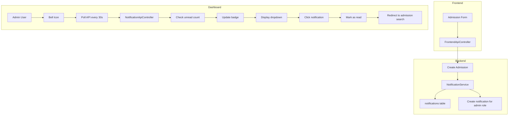

# Notification System Implementation in CodeIgniter 4

## Overview

This document explains how the notification system is implemented to notify admins when an admission is recorded, displaying alerts via the bell icon on the dashboard topbar.

## System Architecture



## Implementation Details

### 1. Database Schema

Two tables manage the notification system:

#### `notifications` Table

Stores notification messages targeted to specific roles.

| Column      | Type         | Description                                              |
| ----------- | ------------ | -------------------------------------------------------- |
| id          | INT          | Primary key                                              |
| target_role | VARCHAR(50)  | Target role: superadmin, admin, frontline, etc.          |
| type        | VARCHAR(50)  | Notification type: new_admission, payment_received, etc. |
| title       | VARCHAR(255) | Notification title                                       |
| message     | TEXT         | Notification message                                     |
| data        | JSON         | Additional data: admission_id, applicant_name, etc.      |
| created_at  | DATETIME     | Creation timestamp                                       |
| updated_at  | DATETIME     | Update timestamp                                         |

#### `notification_reads` Table

Tracks which users have read which notifications.

| Column          | Type     | Description                    |
| --------------- | -------- | ------------------------------ |
| id              | INT      | Primary key                    |
| notification_id | INT      | Foreign key to notifications   |
| user_id         | INT      | User who read the notification |
| read_at         | DATETIME | When it was read               |

### 2. Models

#### NotificationModel (`app/Modules/Notification/Models/NotificationModel.php`)

Key methods:

- `createNotification()` - Creates a new notification for a role
- `createForRoles()` - Creates notifications for multiple roles
- `getUnreadForUser()` - Gets unread notifications for a user based on their roles
- `getUnreadCountForUser()` - Gets count of unread notifications

#### NotificationReadModel (`app/Modules/Notification/Models/NotificationReadModel.php`)

Key methods:

- `markAsRead()` - Marks a single notification as read
- `markAllAsReadForUser()` - Marks multiple notifications as read

### 3. Service Layer

#### NotificationService (`app/Services/NotificationService.php`)

Provides a clean API for creating and managing notifications:

```php
// Create notification for a specific role
$notificationService->createForRole('admin', 'new_admission', 'Title', 'Message', $data);

// Create notification for multiple roles
$notificationService->createForRoles(['superadmin', 'admin'], 'new_admission', 'Title', 'Message', $data);

// Convenience method for admin notifications
$notificationService->notifyAdmins('new_admission', 'Title', 'Message', $data);

// Notify about new admission
$notificationService->notifyNewAdmission([
    'registration_number' => 'REG-2026-00001',
    'program_title' => 'English Course',
    'applicant_name' => 'John Doe',
    'admission_id' => 1
]);
```

### 4. Controllers

#### AdmissionController / FrontendApiController

When creating a new admission, the controller calls the notification service:

```php
// In AdmissionController::store() or FrontendApiController::submitApplication()
$notificationService = new NotificationService();
$notificationService->notifyNewAdmission([
    'registration_number' => $registrationNumber,
    'program_title' => $program->title,
    'applicant_name' => $profile->full_name,
    'admission_id' => $admissionId
]);
```

#### NotificationApiController (`app/Modules/Notification/Controllers/Api/NotificationApiController.php`)

Provides REST API endpoints:

| Endpoint                            | Method | Description                   |
| ----------------------------------- | ------ | ----------------------------- |
| `/notifications/api/unread-count`   | GET    | Get unread notification count |
| `/notifications/api/list`           | GET    | Get notification list         |
| `/notifications/api/mark-read/{id}` | POST   | Mark notification as read     |
| `/notifications/api/mark-all-read`  | POST   | Mark all as read              |

#### NotificationController (`app/Modules/Notification/Controllers/NotificationController.php`)

Renders the notifications page at `/notifications`.

### 5. Frontend Implementation

#### Dashboard Layout (`app/Modules/Dashboard/Views/layout.php`)

The bell icon in the topbar:

```html
<div class="nav-item dropdown me-3">
  <a
    class="nav-link position-relative"
    href="#"
    data-bs-toggle="dropdown"
    id="notificationDropdown"
  >
    <i class="bi bi-bell fs-5"></i>
    <span
      class="notification-badge"
      id="notification-badge"
      style="display: none;"
      >0</span
    >
  </a>
  <div class="dropdown-menu notification-dropdown">
    <!-- Notification list loaded via AJAX -->
  </div>
</div>
```

#### JavaScript Polling

The frontend polls the API every 30 seconds:

```javascript
// Update notification badge count
const updateNotificationCount = () => {
  fetch("/notifications/api/unread-count")
    .then((res) => res.json())
    .then((data) => {
      if (data.count > 0) {
        badge.textContent = data.count > 99 ? "99+" : data.count;
        badge.style.display = "flex";
      }
    });
};

// Initial check
updateNotificationCount();

// Poll every 30 seconds
setInterval(updateNotificationCount, 30000);
```

#### Click Handler

When a notification is clicked:

```javascript
item.addEventListener("click", function () {
  const id = this.dataset.id;
  const applicantName = this.dataset.applicantName;

  // Mark as read
  markAsRead(id);

  // Navigate to admission search
  if (applicantName) {
    window.location.href =
      "/admission/search?keyword=" + encodeURIComponent(applicantName);
  }
});
```

### 6. Routes

Defined in `app/Modules/Notification/Config/Routes.php`:

```php
// Notification Page Routes
$routes->group('notifications', function($routes) {
    $routes->get('/', 'NotificationController::index');
});

// Notification API Routes
$routes->group('notifications/api', function($routes) {
    $routes->get('unread-count', 'NotificationApiController::unreadCount');
    $routes->get('list', 'NotificationApiController::list');
    $routes->post('mark-read/(:num)', 'NotificationApiController::markRead/$1');
    $routes->post('mark-all-read', 'NotificationApiController::markAllRead');
});
```

## How It Works: Step by Step

### When an Admission is Recorded

1. **Frontend Submission**: User submits the admission form
2. **Controller Processing**: `FrontendApiController::submitApplication()` processes the data
3. **Create Records**: Profile, Admission, Installment, and Invoice are created
4. **Create Notification**: `NotificationService::notifyNewAdmission()` is called
5. **Database Insert**: Notification is inserted with `target_role = 'superadmin'` and `target_role = 'admin'`

### When Admin Views Dashboard

1. **Page Load**: Dashboard layout renders with bell icon
2. **Initial Poll**: JavaScript fetches unread count from `/notifications/api/unread-count`
3. **Badge Update**: If count > 0, badge displays the number
4. **Dropdown Click**: When admin clicks bell, notifications load from `/notifications/api/list`
5. **Notification Click**: Admin clicks a notification, it marks as read and redirects to admission search

## Key Design Decisions

### 1. Role-Based Notifications

Instead of notifying specific users, notifications target roles. This means:

- All admins see the same notifications
- No need to maintain user lists
- Automatic support for new admins

### 2. Two-Table Design

Separating notifications from read status allows:

- Multiple users can read the same notification
- Track who read what and when
- Efficient queries for unread count

### 3. Polling Instead of WebSockets

Using polling (every 30 seconds) because:

- Simpler implementation
- No additional server requirements
- Sufficient for this use case (not real-time critical)

### 4. JSON Data Column

The `data` column stores additional context:

```json
{
  "admission_id": 1,
  "registration_number": "REG-2026-00001",
  "program_title": "English Course",
  "applicant_name": "John Doe"
}
```

This allows the frontend to:

- Display relevant information
- Navigate to correct pages
- Filter and search

## File Structure

```
app/
|-- Database/
|   |-- Migrations/
|       |-- 2026-02-14-150000_CreateNotificationsTables.php
|
|-- Services/
|   |-- NotificationService.php
|
|-- Modules/
    |-- Notification/
        |-- Config/
        |   |-- Routes.php
        |-- Controllers/
        |   |-- NotificationController.php
        |   |-- Api/
        |       |-- NotificationApiController.php
        |-- Models/
        |   |-- NotificationModel.php
        |   |-- NotificationReadModel.php
        |-- Views/
            |-- index.php
```

## Usage Examples

### Creating a Notification

```php
use App\Services\NotificationService;

$notificationService = new NotificationService();

// Notify admins about new admission
$notificationService->notifyNewAdmission([
    'registration_number' => 'REG-2026-00001',
    'program_title' => 'English Course',
    'applicant_name' => 'John Doe',
    'admission_id' => 1
]);

// Notify finance about payment
$notificationService->createForRole('finance', 'payment_received',
    'Payment Received',
    'Payment of Rp 1.000.000 received for invoice INV-001',
    ['invoice_id' => 1, 'amount' => 1000000]
);
```

### Getting Unread Count

```php
$user = auth()->user();
$userRoles = $user->getGroups();
$count = $notificationService->getUnreadCountForUser($user->id, $userRoles);
```

### Marking as Read

```php
$notificationService->markAsRead($notificationId, $userId);
// or
$notificationService->markAllAsRead($userId, $userRoles);
```

## Extending the System

### Adding New Notification Types

1. Add a new method to `NotificationService`:

```php
public function notifyPaymentReceived(array $paymentData): void
{
    $this->createForRoles(['finance', 'admin'],
        'payment_received',
        'Payment Received',
        "Payment of {$paymentData['amount']} received",
        $paymentData
    );
}
```

2. Call it from the appropriate controller:

```php
$notificationService->notifyPaymentReceived([
    'invoice_id' => $invoiceId,
    'amount' => $amount,
    'payer_name' => $payerName
]);
```

### Adding Real-Time Notifications

To add WebSocket support:

1. Install a WebSocket library (e.g., Ratchet, Swoole)
2. Create a WebSocket server
3. Modify `NotificationService` to push to WebSocket
4. Update frontend to connect to WebSocket

## Testing

### Manual Testing

1. Log in as frontline user
2. Create a new admission
3. Log in as admin user
4. Check bell icon shows notification count
5. Click bell to see notification
6. Click notification to mark as read and navigate

### API Testing

```bash
# Get unread count
curl -X GET http://localhost:8080/notifications/api/unread-count \
  -H "Cookie: session=your-session-cookie"

# Get notification list
curl -X GET http://localhost:8080/notifications/api/list \
  -H "Cookie: session=your-session-cookie"

# Mark as read
curl -X POST http://localhost:8080/notifications/api/mark-read/1 \
  -H "Cookie: session=your-session-cookie"
```
