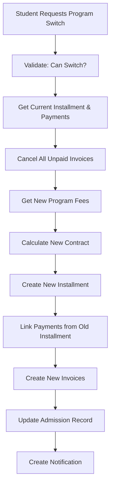

# Switch Program Mechanism - Technical Plan

## Executive Summary

Based on my analysis of the current admission and payment data models, **I strongly recommend creating a NEW installment record** rather than updating the old record. This approach provides better auditability, supports multiple program switches, and maintains clear financial history.

---

## Current Data Model Analysis

### Key Tables:

1. **`admissions`** - Stores admission record with `program_id`
2. **`installments`** - Stores contract/financial data linked by `registration_number`
3. **`invoices`** - Stores invoices linked to `installment_id`
4. **`payments`** - Stores payments linked to `installment_id`

### Current Flow:

```
Admission → Installment (contract) → Invoices → Payments
```

---

## Recommendation: Create NEW Installment Record

### Why NOT update the old record:

- ❌ Loses historical record of program change
- ❌ Cannot track what was paid to which program
- ❌ Complicates financial reporting
- ❌ Makes reconciliation difficult

### Why CREATE new record:

- ✅ Maintains complete audit trail
- ✅ Clear separation of old vs new program financials
- ✅ Supports multiple program switches
- ✅ Easier to calculate credits and remaining balances
- ✅ More transparent for accounting

---

## Implementation Plan

### 1. Database Migration

Add fields to track program switches in the `installments` table:

```sql
ALTER TABLE installments ADD COLUMN parent_installment_id INT NULL;
ALTER TABLE installments ADD COLUMN switch_date DATETIME NULL;
ALTER TABLE installments ADD COLUMN switch_reason TEXT NULL;
ALTER TABLE admissions ADD COLUMN previous_program_id INT NULL;
ALTER TABLE admissions ADD COLUMN program_switch_count INT DEFAULT 0;
```

### 2. New Installment Record Structure

When switching programs, create a NEW installment with:

| Field                   | Value                                |
| ----------------------- | ------------------------------------ |
| `registration_number`   | Same (student's reg number)          |
| `total_contract_amount` | New program (tuition + registration) |
| `total_paid`            | Copied from old installment          |
| `remaining_balance`     | New total - Previous payments        |
| `status`                | recalculated based on remaining      |
| `parent_installment_id` | ID of old installment (for tracking) |
| `switch_date`           | Current timestamp                    |

### 3. Business Logic Flow



### 4. Payment Calculation Formula

```
New Contract Total = New Tuition Fee + New Registration Fee
Credits = Total Paid from Old Installment
-------------------------------------------
New Remaining Balance = New Contract Total - Credits

Additional Payment Due = New Registration Fee + (New Tuition - Old Tuition if positive)
```

### 5. Invoice Handling

- **Cancel**: All unpaid invoices from old program (status: 'cancelled')
- **Create**: New invoices for new program with updated amounts

---

## Files to Modify/Create

### New Files:

1. `app/Modules/Admission/Controllers/SwitchProgramController.php`
2. `app/Modules/Admission/Views/switch_program.php`
3. `app/Database/Migrations/2026-XX-XX_AddProgramSwitchFields.php`

### Modify Existing:

1. `app/Modules/Admission/Config/Routes.php` - Add switch routes
2. `app/Modules/Admission/Config/Menu.php` - Add menu item
3. `app/Modules/Admission/Views/view.php` - Add "Switch Program" button

---

## Acceptance Criteria

1. ✅ Staff can initiate program switch from admission detail page
2. ✅ Old unpaid invoices are automatically cancelled
3. ✅ Previous payments are credited to new contract
4. ✅ New installment record is created with correct amounts
5. ✅ New invoices are generated for the new program
6. ✅ Admission record shows program switch history
7. ✅ Multiple program switches are supported
8. ✅ Financial reports reflect accurate data

---

## Summary

**Create a new installment record** - this is the right approach for:

- Maintaining audit trail
- Supporting multiple switches
- Clear financial tracking
- Accurate reporting

The old installment remains as a historical record (with cancelled invoices), and the new installment carries forward the paid amounts as credits.
