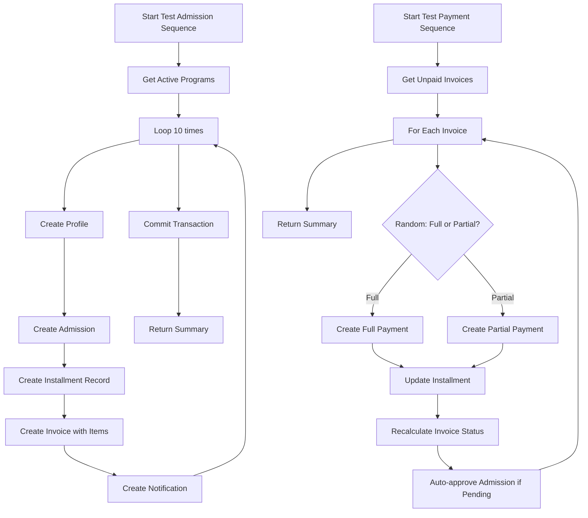

# Test Sequences Implementation Plan

## Overview

Create test sequences in the Settings module to simulate:

1. **Admission Process** - Generate 10 dummy admissions with full flow (profile, admission, invoice, contract)
2. **Payment Process** - Generate payments for all existing unpaid invoices

## Current State Analysis

### Existing Flow (from AdmissionController::store)

1. Create Profile (profiles table)
2. Create Admission (admissions table) with registration_number
3. Create Installment/Contract (installments table)
4. Create Invoice (invoices table) with items JSON
5. Create Notification for admins
6. Send Email notification

### Existing Flow (from PaymentController::store)

1. Create Payment (payments table)
2. Update Installment totals
3. Recalculate Invoice status
4. Auto-approve admission if pending

## Implementation Plan

### 1. Update SettingsController

#### generateTestAdmissions() Method

```php
private function generateTestAdmissions(int $count = 10)
{
    // 1. Get active programs
    $programModel = new ProgramModel();
    $programs = $programModel->where('status', 'active')->findAll();

    if (empty($programs)) {
        throw new Exception('No active programs found');
    }

    // 2. Generate dummy data
    $dummyNames = [
        'Ahmad Rizki', 'Siti Nurhaliza', 'Budi Santoso',
        'Dewi Lestari', 'Eko Prasetyo', 'Fitri Handayani',
        'Gunawan Wibowo', 'Hesti Rahayu', 'Irfan Hakim',
        'Julia Permata', 'Krisna Murti', 'Linda Sari',
        'Muhammad Fadli', 'Nadia Putri', 'Oscar Wijaya'
    ];

    $db->transStart();

    foreach (range(1, $count) as $i) {
        // Create Profile
        // Create Admission
        // Create Installment
        // Create Invoice
    }

    $db->transComplete();
}
```

#### generateTestPayments() Method

```php
private function generateTestPayments()
{
    // 1. Get all unpaid/partially_paid invoices
    $invoices = $invoiceModel->whereIn('status', ['unpaid', 'partially_paid'])->findAll();

    // 2. For each invoice, create payment(s)
    foreach ($invoices as $invoice) {
        // Random: full payment or partial payment
        // Create payment record
        // Update installment
        // Recalculate invoice status
    }
}
```

### 2. Dummy Data Structure

#### Profile Data

- full_name: From dummy names list
- nickname: First name only
- gender: Random male/female
- email: generated email like `test{i}@example.com`
- phone: Random Indonesian phone number
- place_of_birth: Major Indonesian cities
- date_of_birth: Random date (18-30 years old)
- address: Random Indonesian addresses

#### Admission Data

- registration_number: Auto-generated (REG-YYYY-XXXXX)
- program_id: Random from active programs
- status: 'pending' (will be approved on payment)
- application_date: Recent dates

#### Invoice Data

- Items: Registration Fee + Course Fee from program
- Total: Sum of fees
- Status: 'unpaid'

### 3. UI Updates (test_data.php)

Add:

- Progress indicator during generation
- Summary of what was created
- Link to view generated data
- Option to generate payments after admissions

### 4. Routes

Existing routes in Settings/Config/Routes.php:

- GET /settings/test-data - Show form
- POST /settings/generate-test-data - Generate data

## File Changes Required

1. **app/Modules/Settings/Controllers/SettingsController.php**
   - Implement `generateTestAdmissions()`
   - Implement `generateTestPayments()`
   - Update `generateTestData()` to handle count parameter

2. **app/Modules/Settings/Views/test_data.php**
   - Add progress feedback
   - Add summary display
   - Improve UI/UX

## Sequence Flow Diagram



## Testing Checklist

- [ ] Verify 10 profiles created with correct data
- [ ] Verify 10 admissions created with unique registration numbers
- [ ] Verify 10 installments created with correct totals
- [ ] Verify 10 invoices created with correct items
- [ ] Verify notifications created for admins
- [ ] Verify payments created for all invoices
- [ ] Verify invoice status updated correctly
- [ ] Verify installment totals updated
- [ ] Verify admissions auto-approved on payment
