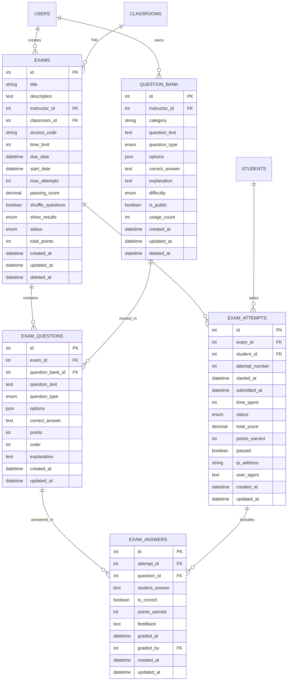
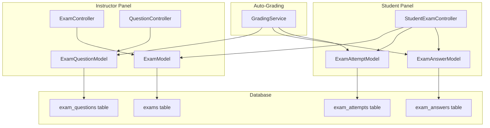

# Exam Module Architecture Plan

## Overview

A comprehensive exam management module that allows instructors to create and manage exams with various question types, and enables students to take exams with auto-grading functionality. Exams can be standalone or linked to classrooms/courses.

## Requirements Summary

### Exam Management (Instructor)

- Create, edit, delete exams
- Configure exam settings: time limit, due date, attempt limits, passing score
- Assign exam to specific classroom(s) or make it open (with access code)
- Add, edit, delete questions with various types
- View exam results and student submissions

### Question Types Supported

1. **Multiple Choice** - Single correct answer from multiple options (auto-graded)
2. **True/False** - Binary choice question (auto-graded)
3. **Fill in the Blank** - Text input with exact match or multiple acceptable answers (auto-graded)
4. **Essay** - Long text answer requiring manual grading by instructor

### Exam Taking (Student)

- View available exams (assigned or open)
- Take exam with timer
- Submit answers
- View results immediately after submission (auto-graded)

### Auto-Grading

- System automatically grades all question types
- Correct answers stored with each question
- Fill in the blank supports multiple acceptable answers

---

## Database Schema

### Table: `exams`

Main exam configuration table.

| Field             | Type         | Description                                           |
| ----------------- | ------------ | ----------------------------------------------------- |
| id                | INT (AI)     | Primary key                                           |
| title             | VARCHAR(255) | Exam title                                            |
| description       | TEXT         | Exam instructions/description                         |
| instructor_id     | INT          | Foreign key to users table (creator)                  |
| classroom_id      | INT          | Foreign key to classrooms table (nullable, null=open) |
| access_code       | VARCHAR(50)  | Access code for open exams (nullable)                 |
| time_limit        | INT          | Time limit in minutes (null = unlimited)              |
| due_date          | DATETIME     | Deadline for taking the exam (nullable)               |
| start_date        | DATETIME     | When exam becomes available (nullable)                |
| max_attempts      | INT          | Maximum attempts allowed (default: 1)                 |
| passing_score     | DECIMAL(5,2) | Minimum score to pass (percentage, nullable)          |
| shuffle_questions | BOOLEAN      | Randomize question order (default: false)             |
| show_results      | ENUM         | When to show results: immediate, after_due, manual    |
| status            | ENUM         | draft, published, closed, archived                    |
| total_points      | INT          | Total points for the exam                             |
| created_at        | DATETIME     | Record creation timestamp                             |
| updated_at        | DATETIME     | Last update timestamp                                 |
| deleted_at        | DATETIME     | Soft delete timestamp                                 |

### Table: `question_bank`

Reusable question repository for instructors.

| Field          | Type         | Description                                    |
| -------------- | ------------ | ---------------------------------------------- |
| id             | INT (AI)     | Primary key                                    |
| instructor_id  | INT          | Foreign key to users table (creator)           |
| category       | VARCHAR(100) | Question category/subject (nullable)           |
| question_text  | TEXT         | The question content                           |
| question_type  | ENUM         | multiple_choice, true_false, fill_blank, essay |
| options        | JSON         | Options for multiple choice (array of strings) |
| correct_answer | TEXT         | Correct answer(s) - JSON array for fill_blank  |
| explanation    | TEXT         | Explanation shown after answering (nullable)   |
| difficulty     | ENUM         | easy, medium, hard (default: medium)           |
| is_public      | BOOLEAN      | Available to all instructors (default: false)  |
| usage_count    | INT          | Number of times used in exams                  |
| created_at     | DATETIME     | Record creation timestamp                      |
| updated_at     | DATETIME     | Last update timestamp                          |
| deleted_at     | DATETIME     | Soft delete timestamp                          |

### Table: `exam_questions`

Questions linked to an exam (from question bank or custom).

| Field            | Type     | Description                                          |
| ---------------- | -------- | ---------------------------------------------------- |
| id               | INT (AI) | Primary key                                          |
| exam_id          | INT      | Foreign key to exams table                           |
| question_bank_id | INT      | Foreign key to question_bank (nullable, null=custom) |
| question_text    | TEXT     | The question content (copied for custom/modified)    |
| question_type    | ENUM     | multiple_choice, true_false, fill_blank, essay       |
| options          | JSON     | Options for multiple choice (array of strings)       |
| correct_answer   | TEXT     | Correct answer(s) - JSON array for fill_blank        |
| points           | INT      | Points for correct answer (default: 1)               |
| order            | INT      | Question order in the exam                           |
| explanation      | TEXT     | Explanation shown after answering (nullable)         |
| created_at       | DATETIME | Record creation timestamp                            |
| updated_at       | DATETIME | Last update timestamp                                |

### Table: `exam_attempts`

Student exam attempt records.

| Field          | Type         | Description                                        |
| -------------- | ------------ | -------------------------------------------------- |
| id             | INT (AI)     | Primary key                                        |
| exam_id        | INT          | Foreign key to exams table                         |
| student_id     | INT          | Foreign key to students table                      |
| attempt_number | INT          | Attempt sequence number                            |
| started_at     | DATETIME     | When the attempt started                           |
| submitted_at   | DATETIME     | When the attempt was submitted (nullable)          |
| time_spent     | INT          | Time spent in seconds                              |
| status         | ENUM         | in_progress, submitted, grading, graded, timed_out |
| total_score    | DECIMAL(5,2) | Total score achieved (percentage)                  |
| points_earned  | INT          | Points earned                                      |
| passed         | BOOLEAN      | Whether student passed (if passing_score set)      |
| ip_address     | VARCHAR(45)  | IP address of the student                          |
| user_agent     | TEXT         | Browser user agent                                 |
| created_at     | DATETIME     | Record creation timestamp                          |
| updated_at     | DATETIME     | Last update timestamp                              |

### Table: `exam_answers`

Individual answers for each question in an attempt.

| Field          | Type     | Description                                        |
| -------------- | -------- | -------------------------------------------------- |
| id             | INT (AI) | Primary key                                        |
| attempt_id     | INT      | Foreign key to exam_attempts table                 |
| question_id    | INT      | Foreign key to exam_questions table                |
| student_answer | TEXT     | The student's answer                               |
| is_correct     | BOOLEAN  | Whether the answer is correct (null for essay)     |
| points_earned  | INT      | Points earned for this answer                      |
| feedback       | TEXT     | Instructor feedback for essay questions (nullable) |
| graded_at      | DATETIME | When the answer was graded                         |
| graded_by      | INT      | User who graded (for manual grading, nullable)     |
| created_at     | DATETIME | Record creation timestamp                          |
| updated_at     | DATETIME | Last update timestamp                              |

---

## Entity Relationship Diagram



---

## Module Structure

```
app/Modules/Exam/
├── Config/
│   ├── Routes.php                    # Route definitions
│   └── Menu.php                      # Sidebar menu configuration
├── Controllers/
│   ├── ExamController.php            # Admin CRUD for exams
│   ├── QuestionController.php        # Question management for exams
│   ├── QuestionBankController.php    # Question bank management
│   ├── GradingController.php         # Manual grading for essays
│   ├── StudentExamController.php     # Student exam taking
│   └── Api/
│       └── ExamApiController.php     # API endpoints for AJAX
├── Models/
│   ├── ExamModel.php                 # Main exam model
│   ├── ExamQuestionModel.php         # Exam questions model
│   ├── QuestionBankModel.php         # Question bank model
│   ├── ExamAttemptModel.php          # Attempts model
│   └── ExamAnswerModel.php           # Answers model
└── Views/
    ├── exam/
    │   ├── index.php                 # Exam listing (admin)
    │   ├── create.php                # Create exam form
    │   ├── edit.php                  # Edit exam form
    │   ├── view.php                  # Exam details (admin)
    │   └── results.php               # View all results
    ├── question/
    │   ├── index.php                 # Question list for exam
    │   ├── create.php                # Create question form
    │   ├── edit.php                  # Edit question form
    │   └── select_from_bank.php      # Select questions from bank
    ├── question_bank/
    │   ├── index.php                 # Question bank listing
    │   ├── create.php                # Create bank question form
    │   ├── edit.php                  # Edit bank question form
    │   └── view.php                  # Question details
    ├── grading/
    │   ├── pending.php               # List of attempts needing grading
    │   └── grade.php                 # Grading interface for essays
    └── student/
        ├── index.php                 # Available exams for student
        ├── take.php                  # Exam taking interface
        ├── result.php                # View exam result
        └── history.php               # Student's exam history
```

---

## API Endpoints

### Admin Routes (Instructor/Admin)

| Method | Endpoint                       | Description                   |
| ------ | ------------------------------ | ----------------------------- |
| GET    | `/exam`                        | List all exams                |
| GET    | `/exam/create`                 | Create exam form              |
| POST   | `/exam/store`                  | Store new exam                |
| GET    | `/exam/show/{id}`              | View exam details             |
| GET    | `/exam/edit/{id}`              | Edit exam form                |
| POST   | `/exam/update/{id}`            | Update exam                   |
| POST   | `/exam/delete/{id}`            | Delete exam                   |
| POST   | `/exam/publish/{id}`           | Publish exam                  |
| GET    | `/exam/{id}/questions`         | List questions for exam       |
| POST   | `/exam/{id}/questions/store`   | Add question to exam          |
| POST   | `/exam/questions/update/{qid}` | Update question               |
| POST   | `/exam/questions/delete/{qid}` | Delete question               |
| POST   | `/exam/questions/reorder`      | Reorder questions             |
| GET    | `/exam/{id}/results`           | View all results for exam     |
| GET    | `/exam/attempts/{attemptId}`   | View specific attempt details |
| GET    | `/exam/pending-grading`        | List attempts needing grading |
| GET    | `/exam/grade/{attemptId}`      | Grading interface for essays  |
| POST   | `/exam/grade/{answerId}`       | Submit grade for essay answer |

### Question Bank Routes (Instructor/Admin)

| Method | Endpoint                      | Description                    |
| ------ | ----------------------------- | ------------------------------ |
| GET    | `/question-bank`              | List question bank             |
| GET    | `/question-bank/create`       | Create question form           |
| POST   | `/question-bank/store`        | Store new question             |
| GET    | `/question-bank/show/{id}`    | View question details          |
| GET    | `/question-bank/edit/{id}`    | Edit question form             |
| POST   | `/question-bank/update/{id}`  | Update question                |
| POST   | `/question-bank/delete/{id}`  | Delete question                |
| GET    | `/question-bank/search`       | Search questions (AJAX)        |
| POST   | `/question-bank/import`       | Import questions (JSON/CSV)    |
| GET    | `/exam/{id}/select-questions` | Select from question bank      |
| POST   | `/exam/{id}/add-from-bank`    | Add selected questions to exam |

### Student Routes

| Method | Endpoint                     | Description                   |
| ------ | ---------------------------- | ----------------------------- |
| GET    | `/my/exams`                  | List available exams          |
| GET    | `/my/exams/{id}`             | View exam details             |
| POST   | `/my/exams/{id}/start`       | Start exam attempt            |
| GET    | `/my/exams/{id}/take`        | Take exam interface           |
| POST   | `/my/exams/{id}/submit`      | Submit exam answers           |
| POST   | `/my/exams/{id}/save-answer` | Save answer (AJAX, auto-save) |
| GET    | `/my/exams/{id}/result`      | View exam result              |
| GET    | `/my/exam-history`           | View all exam history         |

### API Routes (JSON)

| Method | Endpoint                         | Description            |
| ------ | -------------------------------- | ---------------------- |
| GET    | `/api/exams`                     | List exams (JSON)      |
| GET    | `/api/exams/{id}`                | Get exam details       |
| GET    | `/api/exams/{id}/questions`      | Get questions for exam |
| POST   | `/api/exams/{id}/submit`         | Submit exam via API    |
| GET    | `/api/exams/{id}/time-remaining` | Get remaining time     |

---

## Data Flow Diagram



---

## Permissions

| Permission      | Description                       |
| --------------- | --------------------------------- |
| `exam.view`     | View exam list and details        |
| `exam.manage`   | Create, edit, delete exams        |
| `exam.question` | Manage exam questions             |
| `exam.bank`     | Manage question bank              |
| `exam.results`  | View exam results and submissions |
| `exam.grade`    | Grade essay questions             |
| `exam.take`     | Take exams (student)              |

### Permission Matrix Update

```php
// Add to AuthGroups.php permissions array
'exam.view'        => 'Can view exams',
'exam.manage'      => 'Can manage exams (CRUD)',
'exam.question'    => 'Can manage exam questions',
'exam.bank'        => 'Can manage question bank',
'exam.results'     => 'Can view exam results',
'exam.grade'       => 'Can grade essay questions',
'exam.take'        => 'Can take exams',

// Add to matrix
'superadmin' => ['exam.*', ...],
'admin' => ['exam.view', 'exam.manage', 'exam.question', 'exam.bank', 'exam.results', 'exam.grade', ...],
'instructor' => ['exam.view', 'exam.manage', 'exam.question', 'exam.bank', 'exam.results', 'exam.grade', ...],
'student' => ['exam.take', 'exam.view', ...],
```

---

## UI Components

### Admin - Exam List

- Table with title, status, classroom, due date, attempts count
- Quick actions: View, Edit, Questions, Results, Delete
- Filter by status, classroom

### Admin - Exam Form

- Title and description inputs
- Classroom selection (dropdown, optional)
- Access code input (for open exams)
- Time limit input (minutes)
- Date pickers for start/due dates
- Max attempts input
- Passing score input
- Shuffle questions toggle
- Show results dropdown (immediate, after_due, manual)

### Admin - Question Management

- List of questions with drag-and-drop reorder
- Question type selector
- Question text editor
- Options editor for multiple choice
- Correct answer selector
- Points input
- Explanation textarea
- Button to select from question bank
- Option to save question to bank

### Admin - Question Bank

- Table with question text, type, category, difficulty, usage count
- Filter by type, category, difficulty
- Search by question text
- Quick actions: View, Edit, Delete
- Bulk import/export options
- Public/private toggle for sharing

### Admin - Select from Bank Modal

- Searchable list of bank questions
- Filter by type, category, difficulty
- Checkbox selection for multiple questions
- Preview question details
- Points override option
- Add selected to exam

### Student - Exam List

- Grid/list of available exams
- Show exam details: title, time limit, due date, attempts remaining
- Status indicators: Not started, In progress, Completed
- Start/Continue button

### Student - Exam Taking Interface

- Timer display (if time limit set)
- Question navigation sidebar
- Question display area
- Answer input based on question type
- Save/Next/Previous buttons
- Submit button with confirmation

### Student - Result View

- Score display (percentage and points)
- Pass/Fail indicator
- Question-by-question review
- Correct answer vs student answer
- Explanation (if available)

---

## Auto-Grading Logic

### Multiple Choice

```php
// Compare student answer index with correct answer index
$is_correct = ($student_answer == $question->correct_answer);
```

### True/False

```php
// Compare boolean values
$is_correct = ($student_answer === $question->correct_answer);
```

### Fill in the Blank

```php
// Correct answer stored as JSON array of acceptable answers
$acceptable_answers = json_decode($question->correct_answer, true);
$is_correct = in_array(strtolower(trim($student_answer)),
                        array_map('strtolower', $acceptable_answers));
```

### Essay (Manual Grading)

```php
// Essay questions are not auto-graded
// is_correct and points_earned remain null until instructor grades
// Attempt status changes to 'grading' if any essay questions exist
// Instructor assigns points (0 to max_points) and provides feedback
```

---

## Manual Grading Workflow

### Grading Interface (Instructor)

1. **Pending Grading Queue**
   - List of attempts awaiting grading
   - Filter by exam, date submitted
   - Show count of pending essays

2. **Grading Screen**
   - Student name and attempt info
   - Essay question display
   - Student's answer
   - Points slider/input (0 to max points)
   - Feedback textarea
   - Save and next button

3. **Grading Flow**
   - Auto-graded questions show results
   - Essay questions show answer and grading form
   - After all essays graded, calculate final score
   - Update attempt status to 'graded'

### Status Flow with Essays

```
in_progress -> submitted -> grading -> graded
                          ↑
                   (has essay questions)
```

---

## Security Considerations

1. **Access Control**
   - Verify student is assigned to classroom (if exam is classroom-specific)
   - Verify access code for open exams
   - Check attempt limits before allowing new attempt

2. **Exam Integrity**
   - Store time remaining on server side
   - Auto-submit when time expires
   - Track IP address and user agent
   - Prevent opening exam in multiple tabs (optional)

3. **Answer Protection**
   - Don't expose correct answers until after submission
   - Validate answers belong to the exam being taken

---

## Implementation Order

1. **Database Migrations**
   - Create question_bank table
   - Create exams table
   - Create exam_questions table
   - Create exam_attempts table
   - Create exam_answers table

2. **Models**
   - QuestionBankModel with relationships
   - ExamModel with relationships
   - ExamQuestionModel
   - ExamAttemptModel
   - ExamAnswerModel

3. **Question Bank Controllers & Views**
   - QuestionBankController (CRUD)
   - Question bank listing
   - Create/edit questions
   - Search and filter

4. **Admin Controllers & Views**
   - ExamController (CRUD)
   - Question management for exams
   - Select from question bank
   - Results viewing

5. **Student Controllers & Views**
   - Exam listing
   - Exam taking interface
   - Result viewing

6. **Auto-Grading Service**
   - Implement grading logic for MCQ, True/False, Fill in the Blank
   - Score calculation
   - Pass/fail determination

7. **Manual Grading (Essays)**
   - GradingController
   - Pending grading queue view
   - Grading interface
   - Final score calculation after grading

8. **Permissions**
   - Add to AuthGroups config
   - Apply to routes

9. **Testing & Refinement**
   - Test all question types including essays
   - Test time limits
   - Test attempt limits
   - Test access control
   - Test manual grading workflow

---

## Notes

- Question bank allows reusing questions across multiple exams
- Questions from bank are copied to exam_questions with reference to original
- Instructors can make their questions public for other instructors to use
- Fill in the blank supports multiple acceptable answers stored as JSON array
- Essay questions require manual grading by instructor
- Timer is managed both client-side and server-side for security
- Results can be shown immediately, after due date, or manually by instructor
- Soft deletes on exams and question bank to preserve historical data
- Attempt status 'grading' indicates pending essay grading
- Students cannot see results for exams with essays until all essays are graded
- Question usage_count tracks how many times a bank question has been used
