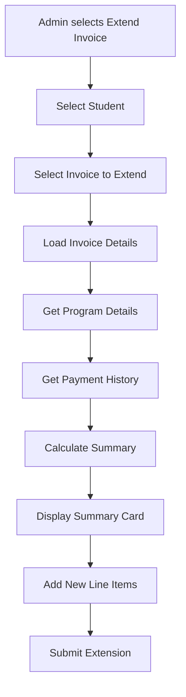

# Plan: Extended Invoice Summary Display

## Overview

This plan outlines the implementation of a summary display when an admin extends an invoice. The summary will show:

1. Initial program amount + registration fee
2. Sum of the amounts paid (from payment history)
3. Outstanding balance (initial program amount + registration fee - sum of amounts paid)
4. Admin added amount for the next payment expected (informational only, not affecting outstanding balance)

## Current State

The invoice extension feature already exists in [`app/Modules/Payment/Views/invoices/create.php`](app/Modules/Payment/Views/invoices/create.php:1). When an admin selects "Extend Previous Invoice", they can:

- Select a student
- Select an existing unpaid/partially_paid invoice
- Add new line items
- Submit to extend the invoice

The current implementation shows basic invoice details but lacks a comprehensive financial summary.

## Requirements

### Display Requirements

When extending an invoice, the admin should see a summary card with:

| Field                      | Description                               | Calculation                                |
| -------------------------- | ----------------------------------------- | ------------------------------------------ |
| **Initial Program Amount** | The original tuition fee from the program | `programs.tuition_fee`                     |
| **Registration Fee**       | The registration fee from the program     | `programs.registration_fee`                |
| **Total Initial Amount**   | Sum of program amount + registration fee  | `tuition_fee + registration_fee`           |
| **Total Paid**             | Sum of all paid payments for this student | `SUM(payments.amount WHERE status='paid')` |
| **Outstanding Balance**    | Remaining amount to be paid               | `Total Initial Amount - Total Paid`        |
| **New Amount Being Added** | Sum of new line items being added         | `SUM(new items amounts)`                   |
| **New Invoice Total**      | Updated invoice total after extension     | `current invoice amount + new amount`      |

### Key Behaviors

- The "New Amount Being Added" is for **information/notification only** - it does NOT affect the outstanding balance calculation
- The outstanding balance is calculated based on the **original program cost** (tuition_fee + registration_fee)
- **IMPORTANT**: The invoice amount is NOT updated when extending. The original invoice amount remains unchanged. The new items are only added for tracking/informational purposes.

## System Architecture

### Data Flow



### Database Relationships

```
invoices
  ├─ registration_number → admissions.registration_number
  ├─ invoice_id → payments.invoice_id
  └─ items (JSON)

admissions
  ├─ registration_number → invoices.registration_number
  └─ program_id → programs.id

programs
  ├─ id → admissions.program_id
  ├─ tuition_fee
  └─ registration_fee

payments
  ├─ invoice_id → invoices.id
  ├─ registration_number → invoices.registration_number
  └─ amount, status
```

## Implementation Details

### 1. InvoiceModel Updates

**File**: [`app/Modules/Payment/Models/InvoiceModel.php`](app/Modules/Payment/Models/InvoiceModel.php:1)

#### New Method: `getExtendedInvoiceSummary()`

```php
/**
 * Get extended invoice summary for display when extending an invoice
 *
 * @param int $invoiceId Invoice ID to extend
 * @return array|null Summary data or null if invoice not found
 */
public function getExtendedInvoiceSummary(int $invoiceId): ?array
{
    $invoice = $this->find($invoiceId);
    if (!$invoice) {
        return null;
    }

    $db = \Config\Database::connect();

    // Get admission details with program information
    $admission = $db->table('admissions')
        ->select('
            admissions.program_id,
            programs.tuition_fee,
            programs.registration_fee
        ')
        ->join('programs', 'programs.id = admissions.program_id')
        ->where('admissions.registration_number', $invoice['registration_number'])
        ->first();

    if (!$admission) {
        return null;
    }

    // Get sum of all paid payments for this student
    $totalPaidResult = $db->table('payments')
        ->selectSum('amount', 'total')
        ->where('registration_number', $invoice['registration_number'])
        ->where('status', 'paid')
        ->where('deleted_at', null)
        ->get()
        ->getRowArray();

    $totalPaid = (float) ($totalPaidResult['total'] ?? 0);

    // Calculate values
    $initialProgramAmount = (float) ($admission['tuition_fee'] ?? 0);
    $registrationFee = (float) ($admission['registration_fee'] ?? 0);
    $totalInitialAmount = $initialProgramAmount + $registrationFee;
    $outstandingBalance = $totalInitialAmount - $totalPaid;

    // Get current invoice items
    $currentItems = $this->decodeItems($invoice['items'] ?? null);

    return [
        'invoice_id' => $invoiceId,
        'invoice_number' => $invoice['invoice_number'],
        'registration_number' => $invoice['registration_number'],
        'initial_program_amount' => $initialProgramAmount,
        'registration_fee' => $registrationFee,
        'total_initial_amount' => $totalInitialAmount,
        'total_paid' => $totalPaid,
        'outstanding_balance' => $outstandingBalance,
        'current_invoice_amount' => (float) $invoice['amount'],
        'current_items' => $currentItems,
        'invoice_status' => $invoice['status']
    ];
}
```

### 2. InvoiceController Updates

**File**: [`app/Modules/Payment/Controllers/InvoiceController.php`](app/Modules/Payment/Controllers/InvoiceController.php:1)

#### New Method: `getInvoiceSummary()`

```php
/**
 * Get extended invoice summary (AJAX endpoint)
 */
public function getInvoiceSummary()
{
    $invoiceId = $this->request->getGet('invoice_id');

    if (!$invoiceId) {
        return $this->response->setJSON(['error' => 'Invoice ID is required']);
    }

    $summary = $this->invoiceModel->getExtendedInvoiceSummary($invoiceId);

    if (!$summary) {
        return $this->response->setJSON(['error' => 'Invoice not found or no program data available']);
    }

    return $this->response->setJSON(['summary' => $summary]);
}
```

### 3. Routes Updates

**File**: [`app/Modules/Payment/Config/Routes.php`](app/Modules/Payment/Config/Routes.php:1)

Add new route:

```php
$routes->get('invoice-summary', 'InvoiceController::getInvoiceSummary');
```

### 4. View Updates

**File**: [`app/Modules/Payment/Views/invoices/create.php`](app/Modules/Payment/Views/invoices/create.php:1)

#### Update the `selectedInvoiceDetails` div to show the summary:

```php
<div id="selectedInvoiceDetails" class="alert alert-info" style="display: none;">
    <!-- Invoice summary will be loaded here -->
</div>
```

#### Add JavaScript to load and display the summary:

```javascript
// Show invoice details and summary when invoice is selected
document
  .getElementById("invoiceSelect")
  .addEventListener("change", function () {
    const invoiceId = this.value;
    const detailsDiv = document.getElementById("selectedInvoiceDetails");
    const invoiceTypeInput = document.getElementById("extendInvoiceType");

    if (!invoiceId) {
      detailsDiv.style.display = "none";
      invoiceTypeInput.value = "";
      return;
    }

    // Get selected option
    const selectedOption = this.options[this.selectedIndex];
    const invoiceType = selectedOption.getAttribute("data-invoice-type");

    // Set the invoice type
    invoiceTypeInput.value = invoiceType;

    // Fetch invoice summary via AJAX
    fetch(`/invoice/invoice-summary?invoice_id=${invoiceId}`)
      .then((response) => response.json())
      .then((data) => {
        if (data.summary) {
          const s = data.summary;
          detailsDiv.innerHTML = `
                    <h6 class="alert-heading"><i class="bi bi-info-circle"></i> Invoice Extension Summary</h6>
                    <hr>
                    <div class="row">
                        <div class="col-md-6">
                            <div class="mb-2">
                                <strong>Invoice Number:</strong> ${s.invoice_number}
                            </div>
                            <div class="mb-2">
                                <strong>Initial Program Amount:</strong> ${formatCurrency(s.initial_program_amount)}
                            </div>
                            <div class="mb-2">
                                <strong>Registration Fee:</strong> ${formatCurrency(s.registration_fee)}
                            </div>
                            <div class="mb-2">
                                <strong>Total Initial Amount:</strong> ${formatCurrency(s.total_initial_amount)}
                            </div>
                        </div>
                        <div class="col-md-6">
                            <div class="mb-2">
                                <strong>Total Paid:</strong> <span class="text-success">${formatCurrency(s.total_paid)}</span>
                            </div>
                            <div class="mb-2">
                                <strong>Outstanding Balance:</strong> 
                                <span class="badge ${s.outstanding_balance > 0 ? "bg-warning" : "bg-success"}">
                                    ${formatCurrency(s.outstanding_balance)}
                                </span>
                            </div>
                            <div class="mb-2">
                                <strong>Current Invoice Amount:</strong> ${formatCurrency(s.current_invoice_amount)}
                            </div>
                            <div class="mb-2">
                                <strong>Invoice Status:</strong> 
                                <span class="badge bg-${s.invoice_status === "paid" ? "success" : s.invoice_status === "partially_paid" ? "info" : "warning"}">
                                    ${s.invoice_status.replace("_", " ")}
                                </span>
                            </div>
                        </div>
                    </div>
                    <hr>
                    <small class="text-muted">
                        <i class="bi bi-lightbulb"></i> 
                        The new amount you add below is for information/notification only and will not affect the outstanding balance calculation.
                        The outstanding balance is based on the original program cost (tuition fee + registration fee).
                    </small>
                `;
          detailsDiv.className = "alert alert-info";
          detailsDiv.style.display = "block";
        } else if (data.error) {
          detailsDiv.innerHTML = `
                    <div class="alert alert-warning">
                        <i class="bi bi-exclamation-triangle"></i> ${data.error}
                    </div>
                `;
          detailsDiv.style.display = "block";
        }
      })
      .catch((error) => {
        console.error("Error fetching invoice summary:", error);
        detailsDiv.innerHTML = `
                <div class="alert alert-danger">
                    <i class="bi bi-x-circle"></i> Failed to load invoice summary. Please try again.
                </div>
            `;
        detailsDiv.style.display = "block";
      });
  });
```

#### Update the items summary table to show "New Amount Being Added":

```javascript
function updateSummary() {
  const descriptions = document.querySelectorAll(".item-description");
  const amounts = document.querySelectorAll(".item-amount");

  let total = 0;
  let previewHtml = "";

  descriptions.forEach((desc, index) => {
    if (desc.value.trim()) {
      const amount = parseFloat(amounts[index].value) || 0;
      total += amount;

      previewHtml += `
                <tr>
                    <td>${escapeHtml(desc.value)}</td>
                    <td style="text-align: right;">${amount.toLocaleString("id-ID", { minimumFractionDigits: 2, maximumFractionDigits: 2 })}</td>
                </tr>
            `;
    }
  });

  document.getElementById("itemsPreview").innerHTML = previewHtml;
  document.getElementById("totalAmount").textContent = total.toLocaleString(
    "id-ID",
    {
      minimumFractionDigits: 2,
      maximumFractionDigits: 2,
    },
  );

  // Update the "New Amount Being Added" label
  const totalLabel = document.querySelector(".total-row td:first-child");
  if (totalLabel) {
    totalLabel.innerHTML = "New Amount Being Added (Informational):";
  }
}
```

## Summary Display Layout

The extended invoice summary will be displayed as an info alert card:

```
┌─────────────────────────────────────────────────────────────────┐
│ ℹ️ Invoice Extension Summary                                     │
├─────────────────────────────────────────────────────────────────┤
│ Invoice Number: INV-2026-0001                                    │
│ Initial Program Amount: Rp 5,000,000                             │
│ Registration Fee: Rp 500,000                                     │
│ Total Initial Amount: Rp 5,500,000                               │
│                                                                 │
│ Total Paid: Rp 2,000,000 (green)                                │
│ Outstanding Balance: Rp 3,500,000 (yellow badge)                │
│ Current Invoice Amount: Rp 5,500,000                             │
│ Invoice Status: partially_paid (blue badge)                     │
├─────────────────────────────────────────────────────────────────┤
│ 💡 The new amount you add below is for information/notification  │
│ only and will not affect the outstanding balance calculation.   │
│ The outstanding balance is based on the original program cost.  │
└─────────────────────────────────────────────────────────────────┘
```

## Testing Checklist

- [ ] Verify that the summary displays correctly when selecting an invoice to extend
- [ ] Verify that the initial program amount and registration fee are correctly retrieved
- [ ] Verify that the total paid amount is correctly calculated from payment history
- [ ] Verify that the outstanding balance is correctly calculated
- [ ] Verify that the new amount being added is shown as informational only
- [ ] Test with students who have no payments (total_paid = 0)
- [ ] Test with students who have fully paid (outstanding_balance = 0)
- [ ] Test with students who have overpaid (outstanding_balance < 0)
- [ ] Verify the summary updates when switching between different invoices

## Files to Modify

1. [`app/Modules/Payment/Models/InvoiceModel.php`](app/Modules/Payment/Models/InvoiceModel.php:1) - Add `getExtendedInvoiceSummary()` method
2. [`app/Modules/Payment/Controllers/InvoiceController.php`](app/Modules/Payment/Controllers/InvoiceController.php:1) - Add `getInvoiceSummary()` method
3. [`app/Modules/Payment/Config/Routes.php`](app/Modules/Payment/Config/Routes.php:1) - Add route for invoice summary
4. [`app/Modules/Payment/Views/invoices/create.php`](app/Modules/Payment/Views/invoices/create.php:1) - Update JavaScript to load and display summary
