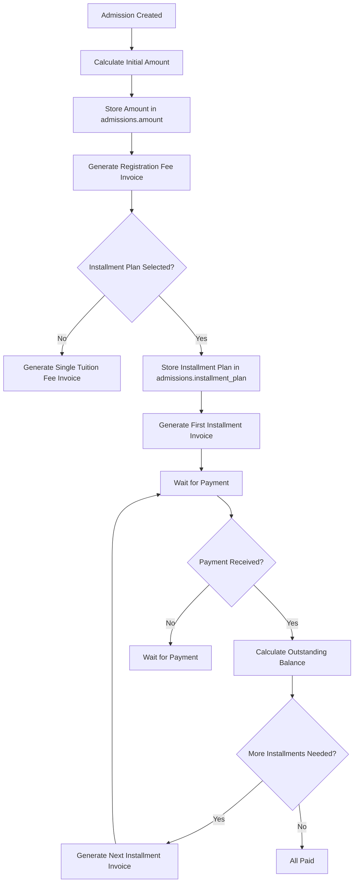
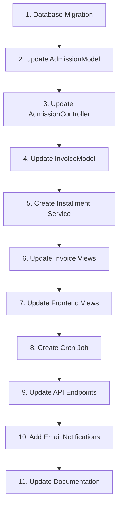

# Plan: Installment-Based Invoice System (Simplified)

## Overview

This plan outlines a simplified installment-based invoice system for the FEECS application. The system uses the `admissions` table to track the initial program amount and calculates outstanding balance dynamically.

**Key Concept:**

- Store initial program amount in `admissions` table
- Calculate outstanding balance: `initial_amount - total_payments`
- Generate installment invoices based on outstanding balance

---

## Current System Analysis

### Existing Invoice Types

| Type                | Purpose                   | Current Behavior                                    |
| ------------------- | ------------------------- | --------------------------------------------------- |
| `registration_fee`  | One-time registration fee | Auto-generated on admission creation                |
| `tuition_fee`       | Tuition fee               | Currently single invoice, needs installment support |
| `miscellaneous_fee` | Other fees                | Manual creation                                     |

### Current Invoice Status Flow

```
unpaid → partially_paid → paid
         ↓
       expired
         ↓
       cancelled
```

### Current Payment Status Flow

```
pending → paid
    ↓
  failed
    ↓
refunded
```

---

## Proposed Installment Invoice Workflow

### 1. Database Schema Changes

#### New Column: `amount` in `admissions` table

```php
'amount' => [
    'type' => 'DECIMAL',
    'constraint' => '10,2',
    'default' => 0.00,
    'after' => 'program_id'
]
```

**Purpose**: Stores the initial program amount (registration_fee + tuition_fee) charged to the student.

#### New Column: `installment_plan` in `admissions` table

```php
'installment_plan' => [
    'type' => 'JSON',
    'null' => true,
    'after' => 'amount'
]
```

**Purpose**: Stores the installment configuration for this specific admission.

**Example JSON structure:**

```json
{
  "enabled": true,
  "total_installments": 3,
  "installment_interval_days": 30,
  "installment_amounts": [1000000, 1000000, 1000000],
  "due_date_offset_days": 7
}
```

#### New Column: `installment_number` in `invoices` table

```php
'installment_number' => [
    'type' => 'INT',
    'null' => true,
    'after' => 'invoice_type'
]
```

**Purpose**: Tracks which installment this is (1, 2, 3, etc.). Null for non-installment invoices.

---

### 2. Invoice Generation Workflow



---

### 3. Outstanding Balance Calculation

The outstanding balance is calculated dynamically:

```php
function getOutstandingBalance($registrationNumber) {
    $admissionModel = new AdmissionModel();
    $paymentModel = new PaymentModel();

    // Get initial amount from admission
    $admission = $admissionModel
        ->where('registration_number', $registrationNumber)
        ->first();

    $initialAmount = (float) $admission['amount'];

    // Get total paid amount
    $payments = $paymentModel
        ->where('registration_number', $registrationNumber)
        ->where('status', 'paid')
        ->findAll();

    $totalPaid = 0;
    foreach ($payments as $payment) {
        $totalPaid += (float) $payment['amount'];
    }

    return $initialAmount - $totalPaid;
}
```

---

### 4. Invoice Generation Logic

#### Initial Invoice Generation (On Admission)

```php
// 1. Calculate initial amount
$initialAmount = $program['registration_fee'] + $program['tuition_fee'];

// 2. Store in admission
$admissionData = [
    'registration_number' => $registrationNumber,
    'program_id' => $programId,
    'amount' => $initialAmount,
    // ... other fields
];

// 3. Generate Registration Fee Invoice
$regInvoice = [
    'invoice_type' => 'registration_fee',
    'amount' => $program['registration_fee'],
    'due_date' => date('Y-m-d', strtotime('+3 days')),
    'status' => 'unpaid'
];

// 4. Generate Tuition Fee Invoice(s)
if ($installmentPlan['enabled']) {
    // Store installment plan in admission
    $admissionData['installment_plan'] = json_encode($installmentPlan);

    // Generate first installment
    $installment1 = [
        'invoice_type' => 'tuition_fee',
        'amount' => $installmentPlan['installment_amounts'][0],
        'installment_number' => 1,
        'due_date' => date('Y-m-d', strtotime('+' . $installmentPlan['due_date_offset_days'] . ' days')),
        'status' => 'unpaid'
    ];
} else {
    // Single tuition fee invoice
    $tuitionInvoice = [
        'invoice_type' => 'tuition_fee',
        'amount' => $program['tuition_fee'],
        'due_date' => date('Y-m-d', strtotime('+7 days')),
        'status' => 'unpaid'
    ];
}
```

#### Subsequent Installment Generation

Triggered when:

1. Previous installment is paid
2. Outstanding balance > 0
3. More installments remaining in plan

```php
function generateNextInstallment($registrationNumber) {
    $admissionModel = new AdmissionModel();
    $invoiceModel = new InvoiceModel();

    // Get admission with installment plan
    $admission = $admissionModel
        ->where('registration_number', $registrationNumber)
        ->first();

    $plan = json_decode($admission['installment_plan'], true);

    // Get current installment count
    $currentInstallments = $invoiceModel
        ->where('registration_number', $registrationNumber)
        ->where('invoice_type', 'tuition_fee')
        ->where('installment_number IS NOT NULL')
        ->countAllResults();

    // Check if more installments needed
    if ($currentInstallments < $plan['total_installments']) {
        $nextInstallment = $currentInstallments + 1;

        // Calculate outstanding balance
        $outstandingBalance = $this->getOutstandingBalance($registrationNumber);

        // Use planned amount or remaining balance (whichever is smaller)
        $plannedAmount = $plan['installment_amounts'][$nextInstallment - 1];
        $installmentAmount = min($plannedAmount, $outstandingBalance);

        if ($installmentAmount > 0) {
            $newInvoice = [
                'invoice_type' => 'tuition_fee',
                'registration_number' => $registrationNumber,
                'amount' => $installmentAmount,
                'installment_number' => $nextInstallment,
                'due_date' => date('Y-m-d', strtotime('+' . $plan['installment_interval_days'] . ' days')),
                'status' => 'unpaid'
            ];

            return $invoiceModel->createInvoice($newInvoice);
        }
    }

    return null;
}
```

---

### 5. Installment Configuration

#### Program-Level Default Configuration

Each program can have a default installment plan:

```json
{
  "enabled": true,
  "total_installments": 3,
  "installment_interval_days": 30,
  "installment_amounts": [1000000, 1000000, 1000000],
  "due_date_offset_days": 7
}
```

**Fields:**

- `enabled`: Whether installments are available for this program
- `total_installments`: Number of installments (e.g., 3 for 3 installments)
- `installment_interval_days`: Days between installments (e.g., 30 for monthly)
- `installment_amounts`: Array of amounts for each installment
- `due_date_offset_days`: Days after previous payment for next invoice

#### Student-Level Selection

Students can choose their installment plan during admission:

```json
{
  "selected_plan": "3_installments",
  "total_installments": 3,
  "installment_interval_days": 30,
  "installment_amounts": [1000000, 1000000, 1000000]
}
```

---

### 6. Frontend Display

#### Outstanding Balance Display

```php
// In frontend views
$outstandingBalance = getOutstandingBalance($registrationNumber);
$totalPaid = $admission['amount'] - $outstandingBalance;
$progressPercentage = ($totalPaid / $admission['amount']) * 100;
```

**Display Example:**

```
Total Amount: Rp 3,000,000
Paid: Rp 1,000,000
Outstanding: Rp 2,000,000
Progress: [====    ] 33%
```

---

### 7. User Interface Changes

#### Admission Form

- Add installment plan selection dropdown
- Show installment breakdown preview
- Display total amount and installment amounts

#### Invoice List View

- Show installment number for installment invoices
- Display outstanding balance for each admission
- Show payment progress bar

#### Invoice Detail View

- Show related admission information
- Display outstanding balance
- Show installment progress

#### Payment Creation

- Show outstanding balance before payment
- Display remaining installments
- Option to pay custom amount (up to outstanding balance)

---

### 8. API Endpoints

#### New Endpoints

| Method | Endpoint                                                          | Description                       |
| ------ | ----------------------------------------------------------------- | --------------------------------- |
| GET    | `/api/admissions/{registration_number}/outstanding`               | Get outstanding balance           |
| GET    | `/api/admissions/{registration_number}/installments`              | Get all installment invoices      |
| POST   | `/api/admissions/{registration_number}/generate-next-installment` | Manually trigger next installment |
| GET    | `/api/admissions/{registration_number}/progress`                  | Get payment progress summary      |

---

### 9. Cron Job for Automatic Installment Generation

```php
// app/Commands/GenerateInstallmentInvoices.php
class GenerateInstallmentInvoices extends BaseCommand
{
    protected $group = 'Tasks';
    protected $name = 'invoices:generate-installments';
    protected $description = 'Generate installment invoices based on schedule';

    public function run(array $params)
    {
        $admissionModel = new AdmissionModel();
        $invoiceModel = new InvoiceModel();

        // Get admissions with installment plans
        $admissions = $admissionModel
            ->where('installment_plan IS NOT NULL')
            ->where('status', 'approved')
            ->findAll();

        foreach ($admissions as $admission) {
            $plan = json_decode($admission['installment_plan'], true);

            // Get last installment
            $lastInstallment = $invoiceModel
                ->where('registration_number', $admission['registration_number'])
                ->where('invoice_type', 'tuition_fee')
                ->where('installment_number IS NOT NULL')
                ->orderBy('installment_number', 'DESC')
                ->first();

            if ($lastInstallment && $lastInstallment['status'] === 'paid') {
                // Check if it's time to generate next installment
                $lastPaymentDate = $this->getLastPaymentDate($lastInstallment['id']);
                $nextDueDate = date('Y-m-d', strtotime($lastPaymentDate . ' +' . $plan['installment_interval_days'] . ' days'));

                if (date('Y-m-d') >= $nextDueDate) {
                    $this->generateNextInstallment($admission['registration_number']);
                }
            }
        }
    }
}
```

---

### 10. Email Notifications

#### Installment Due Reminder

- Sent 3 days before installment due date
- Includes installment number and amount
- Shows outstanding balance
- Link to payment page

#### Installment Generated Notification

- Sent when new installment is generated
- Includes due date and amount
- Shows remaining balance
- Link to invoice detail

#### Payment Confirmation

- Sent after payment is confirmed
- Shows new outstanding balance
- Shows remaining installments

---

## Implementation Order



---

## Testing Checklist

- [ ] Initial amount stored in admissions table
- [ ] Registration fee invoice generated on admission
- [ ] First installment invoice generated when plan selected
- [ ] Outstanding balance calculated correctly
- [ ] Subsequent installments generated after payment
- [ ] Installment progress displayed correctly
- [ ] Cron job generates installments on schedule
- [ ] Email notifications sent correctly
- [ ] API endpoints return correct data
- [ ] Manual installment generation works
- [ ] Frontend displays outstanding balance correctly

---

## Notes

1. **Simplified Architecture**: No parent invoice needed. Each installment is independent.
2. **Dynamic Calculation**: Outstanding balance is calculated from admission amount minus payments.
3. **Flexible Plans**: Installment plan stored per admission, allowing customization.
4. **Payment Flexibility**: Students can pay any amount up to outstanding balance.
5. **Audit Trail**: All invoice generations and payments are logged.
6. **Backward Compatibility**: Existing admissions without installment data continue to work.
