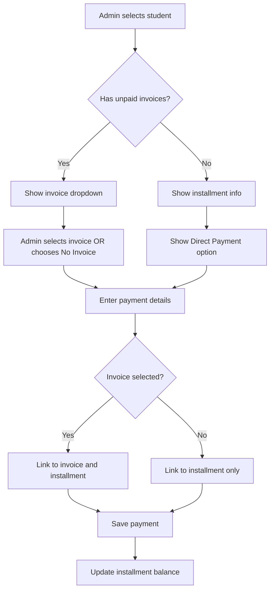

# Invoice-less Payment Implementation Plan

## Overview

Allow admins to create payments without requiring an invoice, while still affecting the student's contract/installment balance.

## Current System Analysis

### Database Schema

- **payments table**: `invoice_id` is already nullable (via `permit_empty` validation)
- **payments table**: `installment_id` is already nullable
- **installments table**: Tracks `total_contract_amount`, `total_paid`, `remaining_balance`

### Current Flow

1. Admin selects student → System fetches unpaid invoices
2. Admin selects invoice → Invoice details shown
3. Admin enters payment details → Payment saved with invoice_id and installment_id

### Problem

When no unpaid/partially paid invoices exist, admin cannot create a payment even though the student may have an installment/contract balance.

## Solution Design

### Flow Diagram



## Implementation Steps

### 1. Modify Payment Creation View

**File**: `app/Modules/Payment/Views/payments/create.php`

Changes needed:

- Remove `required` attribute from invoice dropdown
- Add No Invoice option when no payable invoices found
- Show installment/contract balance section when student selected
- Display contract balance info for direct payments

### 2. Add API Endpoint for Installment Info

**File**: `app/Modules/Payment/Controllers/Api/InvoiceApiController.php`

Add new method `getInstallmentInfo($registrationNumber)`:

- Returns installment details: total_contract_amount, total_paid, remaining_balance
- Used to show balance info when no invoices available

### 3. Update PaymentController store Method

**File**: `app/Modules/Payment/Controllers/PaymentController.php`

Modify `store()` method:

- Handle null invoice_id gracefully
- Still link to installment if exists
- Update installment balance regardless of invoice linkage

### 4. Update Routes

**File**: `app/Modules/Payment/Config/Routes.php`

Add route for installment info API:

```php
$routes->get('api/installments/student/(:segment)', 'InvoiceApiController::getInstallmentInfo/$1');
```

## Detailed Changes

### 1. View Changes - create.php

```javascript
// When no payable invoices found, show option for direct payment
if (!payableFound) {
  invoiceSelect.append(
    '<option value="">-- No Invoice - Direct Payment --</option>',
  );
  invoiceSelect.prop("disabled", false);

  // Show installment balance section
  loadInstallmentInfo(regNumber);
}
```

Add new section for installment info:

```html
<!-- Installment/Contract Balance Summary -->
<div id="installmentSummary" class="card mb-3" style="display: none;">
  <div class="card-header" style="background-color: #6B0000; color: white;">
    <h5 class="mb-0">Contract Balance</h5>
  </div>
  <div class="card-body">
    <div class="row">
      <div class="col-md-4">
        <div class="mb-2">
          <span class="info-label">Total Contract:</span>
          <span id="contractTotal">-</span>
        </div>
      </div>
      <div class="col-md-4">
        <div class="mb-2">
          <span class="info-label">Total Paid:</span>
          <span id="contractPaid">-</span>
        </div>
      </div>
      <div class="col-md-4">
        <div class="mb-2">
          <span class="info-label">Remaining Balance:</span>
          <span id="contractBalance" class="badge bg-warning">-</span>
        </div>
      </div>
    </div>
  </div>
</div>
```

### 2. API Endpoint - InvoiceApiController.php

```php
/**
 * Get installment info for a student
 */
public function getInstallmentInfo($registrationNumber)
{
    $installment = $this->installmentModel->getWithDetails($registrationNumber);

    if (!$installment) {
        return $this->response->setJSON([
            'status' => 'error',
            'message' => 'No installment/contract found for this student'
        ]);
    }

    return $this->response->setJSON([
        'status' => 'success',
        'data' => [
            'id' => $installment['id'],
            'total_contract_amount' => $installment['total_contract_amount'],
            'total_paid' => $installment['total_paid'],
            'remaining_balance' => $installment['remaining_balance'],
            'status' => $installment['status'],
            'program_title' => $installment['program_title'] ?? 'N/A'
        ]
    ]);
}
```

### 3. Controller Changes - PaymentController.php

```php
public function store()
{
    $invoiceId = $this->request->getPost('invoice_id');
    $registrationNumber = $this->request->getPost('registration_number');
    $installmentId = null;

    // If invoice selected, get its installment
    if ($invoiceId) {
        $invoice = $this->invoiceModel->find($invoiceId);
        if ($invoice && !empty($invoice['installment_id'])) {
            $installmentId = $invoice['installment_id'];
        }
    }

    // If no invoice but has registration_number, find installment
    if (!$installmentId && $registrationNumber) {
        $installment = $this->installmentModel->getByRegistrationNumber($registrationNumber);
        if ($installment) {
            $installmentId = $installment['id'];
        }
    }

    $data = [
        'registration_number' => $registrationNumber,
        'invoice_id' => $invoiceId ?: null,
        'installment_id' => $installmentId,
        // ... rest of payment data
    ];

    // Save payment
    if ($this->paymentModel->insert($data)) {
        $paymentId = $this->paymentModel->insertID();

        // Update installment totals (works for both with and without invoice)
        if ($installmentId) {
            $this->installmentModel->updatePaymentTotal($installmentId);
        }

        // ... rest of logic
    }
}
```

## Key Points

1. **No database migration needed** - `invoice_id` is already nullable
2. **Installment linkage is automatic** - PaymentModel already has auto-link logic
3. **Balance update is automatic** - `updatePaymentTotal()` recalculates from all payments
4. **Backward compatible** - Existing invoice-linked payments work unchanged

## Testing Checklist

- [ ] Create payment with invoice selected (existing behavior)
- [ ] Create payment without invoice when installment exists
- [ ] Create payment without invoice when no installment exists
- [ ] Verify installment balance updates correctly
- [ ] Verify payment appears in payment list
- [ ] Verify receipt generation works
