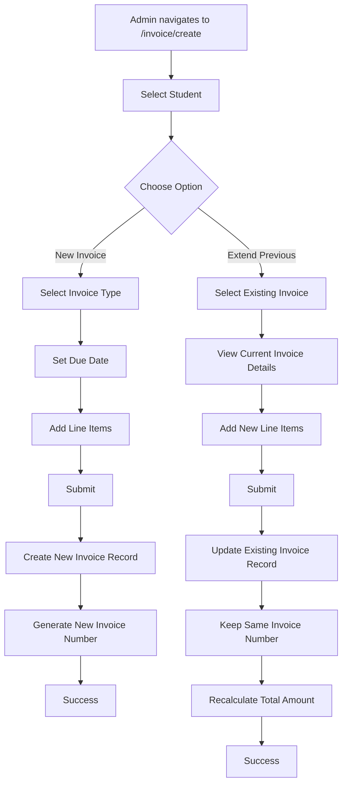

# Plan: Invoice Creation with New vs Extend Options

## Overview

This plan outlines the implementation of a feature that allows admins to choose between creating a new invoice or extending an existing unpaid/partially_paid invoice when creating invoices at `http://localhost:8080/invoice/create`.

## Business Requirements

### Use Cases

1. **New Invoice**: When a student has a new purchase outside the program admission (e.g., transportation fee, miscellaneous fee, etc.), create a completely new invoice with a new invoice number.

2. **Extend Previous Invoice**: When a student has made partial payments on an existing invoice, the admin can extend that same invoice by adding more items/amount to it. The invoice number remains the same, and the record is updated (not a new record).

### Key Behaviors

- **New Invoice**: Creates a new record with a new invoice number
- **Extend Invoice**: Updates an existing invoice record (same invoice number) by adding new items and increasing the total amount
- Only unpaid or partially_paid invoices can be extended
- Paid, cancelled, or expired invoices cannot be extended

---

## System Architecture

### Current Invoice Status Flow

```
unpaid → partially_paid → paid
         ↓
       expired
         ↓
       cancelled
```

### New Invoice Creation Flow



---

## Database Schema Changes

### New Column: `parent_invoice_id` in `invoices` table

**Purpose**: Track which invoice was extended to create the current invoice. This creates a chain of extensions for audit purposes.

```php
'parent_invoice_id' => [
    'type' => 'INT',
    'constraint' => 11,
    'unsigned' => true,
    'null' => true,
    'after' => 'invoice_type'
]
```

**Usage**:

- `NULL`: This is a new invoice (not an extension)
- `INT`: This invoice was created by extending the invoice with this ID

**Note**: When extending an invoice, we UPDATE the existing record, not create a new one. The `parent_invoice_id` is used for tracking the history of extensions if needed for reporting.

---

## Implementation Details

### 1. Database Migration

**File**: `app/Database/Migrations/2026-02-11-000001_AddParentInvoiceIdToInvoices.php`

```php
<?php

namespace App\Database\Migrations;

use CodeIgniter\Database\Migration;

class AddParentInvoiceIdToInvoices extends Migration
{
    public function up()
    {
        $this->forge->addColumn('invoices', [
            'parent_invoice_id' => [
                'type' => 'INT',
                'constraint' => 11,
                'unsigned' => true,
                'null' => true,
                'after' => 'invoice_type'
            ]
        ]);

        $this->forge->addKey('parent_invoice_id');
        $this->forge->addForeignKey('parent_invoice_id', 'invoices', 'id', 'CASCADE', 'SET NULL');
    }

    public function down()
    {
        $this->forge->dropForeignKey('invoices', 'invoices_parent_invoice_id_foreign');
        $this->forge->dropColumn('invoices', 'parent_invoice_id');
    }
}
```

---

### 2. InvoiceModel Updates

**File**: `app/Modules/Payment/Models/InvoiceModel.php`

#### Add to `$allowedFields`:

```php
protected $allowedFields = [
    'invoice_number',
    'registration_number',
    'description',
    'amount',
    'due_date',
    'invoice_type',
    'status',
    'items',
    'parent_invoice_id'  // Add this
];
```

#### New Method: `getExtendableInvoices()`

```php
/**
 * Get unpaid or partially_paid invoices for a student that can be extended
 *
 * @param string $registrationNumber Student registration number
 * @return array
 */
public function getExtendableInvoices(string $registrationNumber): array
{
    return $this->where('registration_number', $registrationNumber)
        ->whereIn('status', ['unpaid', 'partially_paid'])
        ->orderBy('created_at', 'DESC')
        ->findAll();
}
```

#### New Method: `extendInvoice()`

```php
/**
 * Extend an existing invoice by adding new items and updating amount
 *
 * @param int $invoiceId Invoice ID to extend
 * @param array $newItems New items to add
 * @param string $newDescription Optional new description
 * @return bool
 */
public function extendInvoice(int $invoiceId, array $newItems, ?string $newDescription = null): bool
{
    $invoice = $this->find($invoiceId);

    if (!$invoice) {
        return false;
    }

    // Check if invoice can be extended
    if (!in_array($invoice['status'], ['unpaid', 'partially_paid'])) {
        return false;
    }

    // Get existing items
    $existingItems = $this->decodeItems($invoice['items'] ?? null);

    // Merge existing and new items
    $allItems = array_merge($existingItems, $newItems);

    // Calculate new total amount
    $newTotalAmount = 0;
    foreach ($allItems as $item) {
        $newTotalAmount += (float) $item['amount'];
    }

    // Prepare update data
    $updateData = [
        'items' => $this->encodeItems($allItems),
        'amount' => $newTotalAmount
    ];

    // Update description if provided
    if ($newDescription) {
        $updateData['description'] = $newDescription;
    }

    return $this->update($invoiceId, $updateData);
}
```

#### New Method: `getInvoiceExtensionHistory()`

```php
/**
 * Get the extension history for an invoice
 *
 * @param int $invoiceId Invoice ID
 * @return array
 */
public function getInvoiceExtensionHistory(int $invoiceId): array
{
    $history = [];
    $currentId = $invoiceId;

    while ($currentId) {
        $invoice = $this->find($currentId);
        if (!$invoice) {
            break;
        }

        $history[] = [
            'id' => $invoice['id'],
            'invoice_number' => $invoice['invoice_number'],
            'amount' => $invoice['amount'],
            'status' => $invoice['status'],
            'created_at' => $invoice['created_at']
        ];

        $currentId = $invoice['parent_invoice_id'] ?? null;
    }

    return $history;
}
```

---

### 3. InvoiceController Updates

**File**: `app/Modules/Payment/Controllers/InvoiceController.php`

#### Update `create()` method:

```php
public function create()
{
    // Get all approved admissions with student details for dropdown
    $students = $this->admissionModel->getAllWithDetails();

    // Filter only approved admissions
    $students = array_filter($students, function ($student) {
        return $student['status'] === 'approved';
    });

    return view('Modules\Payment\Views\invoices\create', [
        'title' => 'Create Invoice',
        'students' => $students,
        'menuItems' => $this->loadModuleMenus(),
        'user' => auth()->user()
    ]);
}
```

#### Update `store()` method:

```php
public function store()
{
    $action = $this->request->getPost('action'); // 'new' or 'extend'
    $items = $this->request->getPost('items');

    // Validate that items exist
    if (!$items || !is_array($items)) {
        return redirect()->back()->withInput()->with('error', 'Please add at least one line item.');
    }

    // Filter and validate items, calculate total
    $validItems = [];
    $totalAmount = 0;

    foreach ($items as $item) {
        if (!empty($item['description']) && !empty($item['amount'])) {
            $amount = (float) $item['amount'];
            if ($amount > 0) {
                $validItems[] = [
                    'description' => trim($item['description']),
                    'amount' => $amount
                ];
                $totalAmount += $amount;
            }
        }
    }

    // Validate total amount
    if (empty($validItems) || $totalAmount <= 0) {
        return redirect()->back()->withInput()->with('error', 'Please add at least one valid line item with amount greater than zero.');
    }

    if ($action === 'extend') {
        // EXTEND EXISTING INVOICE
        $invoiceId = $this->request->getPost('invoice_id');

        if (!$invoiceId) {
            return redirect()->back()->withInput()->with('error', 'Please select an invoice to extend.');
        }

        // Extend the invoice
        if ($this->invoiceModel->extendInvoice($invoiceId, $validItems)) {
            return redirect()->to('/invoice/view/' . $invoiceId)
                ->with('success', 'Invoice extended successfully.');
        }

        return redirect()->back()->withInput()->with('error', 'Failed to extend invoice. The invoice may not be extendable.');
    } else {
        // CREATE NEW INVOICE
        $invoiceData = [
            'registration_number' => $this->request->getPost('registration_number'),
            'description' => 'Invoice with ' . count($validItems) . ' item(s)',
            'amount' => $totalAmount,
            'due_date' => $this->request->getPost('due_date'),
            'invoice_type' => $this->request->getPost('invoice_type'),
            'items' => $this->invoiceModel->encodeItems($validItems)
        ];

        // Create invoice with items
        $invoiceId = $this->invoiceModel->createInvoice($invoiceData);

        if ($invoiceId) {
            return redirect()->to('/invoice')->with('success', 'Invoice created successfully.');
        }

        return redirect()->back()->withInput()->with('errors', $this->invoiceModel->errors());
    }
}
```

#### New Method: `getStudentInvoices()`

```php
/**
 * Get unpaid/partially_paid invoices for a student (AJAX endpoint)
 */
public function getStudentInvoices()
{
    $registrationNumber = $this->request->getGet('registration_number');

    if (!$registrationNumber) {
        return $this->response->setJSON(['error' => 'Registration number is required']);
    }

    $invoices = $this->invoiceModel->getExtendableInvoices($registrationNumber);

    return $this->response->setJSON(['invoices' => $invoices]);
}
```

---

### 4. Routes Updates

**File**: `app/Modules/Payment/Config/Routes.php`

Add to the invoice routes group:

```php
$routes->get('create', 'InvoiceController::create');
$routes->post('store', 'InvoiceController::store');
$routes->get('student-invoices', 'InvoiceController::getStudentInvoices'); // Add this
```

---

### 5. View Updates

**File**: `app/Modules/Payment/Views/invoices/create.php`

#### Add option selection section at the top:

```php
<div class="card mb-3">
    <div class="card-body">
        <h5 class="card-title mb-3">Invoice Creation Option</h5>
        <div class="btn-group w-100" role="group">
            <input type="radio" class="btn-check" name="invoiceOption" id="optionNew" value="new" checked>
            <label class="btn btn-outline-primary" for="optionNew">
                <i class="bi bi-plus-circle"></i> Create New Invoice
            </label>

            <input type="radio" class="btn-check" name="invoiceOption" id="optionExtend" value="extend">
            <label class="btn btn-outline-warning" for="optionExtend">
                <i class="bi bi-arrow-repeat"></i> Extend Previous Invoice
            </label>
        </div>
    </div>
</div>
```

#### Add extend invoice section (hidden by default):

```php
<!-- Extend Invoice Section (Hidden by default) -->
<div id="extendInvoiceSection" class="card mb-3" style="display: none;">
    <div class="card-body">
        <h5 class="card-title mb-3">Select Invoice to Extend</h5>

        <div class="mb-3">
            <label class="form-label">Student *</label>
            <select name="registration_number" class="form-select" id="studentSelect" required>
                <option value="">Select Student First</option>
                <?php foreach ($students as $student): ?>
                    <option value="<?= esc($student['registration_number']) ?>">
                        <?= esc($student['full_name']) ?> (<?= esc($student['registration_number']) ?>)
                    </option>
                <?php endforeach ?>
            </select>
        </div>

        <div class="mb-3" id="invoiceSelectContainer" style="display: none;">
            <label class="form-label">Select Invoice to Extend *</label>
            <select name="invoice_id" class="form-select" id="invoiceSelect" required>
                <option value="">Select Invoice</option>
            </select>
        </div>

        <div id="selectedInvoiceDetails" class="alert alert-info" style="display: none;">
            <!-- Invoice details will be loaded here -->
        </div>
    </div>
</div>
```

#### Update new invoice section (shown by default):

```php
<!-- New Invoice Section (Shown by default) -->
<div id="newInvoiceSection" class="card mb-3">
    <div class="card-body">
        <div class="mb-3">
            <label class="form-label">Student *</label>
            <select name="registration_number" class="form-select" id="newStudentSelect" required>
                <option value="">Select Student</option>
                <?php foreach ($students as $student): ?>
                    <option value="<?= esc($student['registration_number']) ?>">
                        <?= esc($student['full_name']) ?> (<?= esc($student['registration_number']) ?>)
                    </option>
                <?php endforeach ?>
            </select>
        </div>

        <div class="mb-3">
            <label class="form-label">Invoice Type *</label>
            <select name="invoice_type" class="form-select" required>
                <option value="">Select Type</option>
                <option value="registration_fee">Registration Fee</option>
                <option value="tuition_fee">Tuition Fee</option>
                <option value="miscellaneous_fee">Miscellaneous Fee</option>
            </select>
        </div>

        <div class="mb-3">
            <label class="form-label">Due Date *</label>
            <input type="date" name="due_date" class="form-control" required>
        </div>
    </div>
</div>
```

#### Add JavaScript for dynamic behavior:

```javascript
<script>
    let lineItemCount = 0;

    // Handle option selection
    document.querySelectorAll('input[name="invoiceOption"]').forEach(radio => {
        radio.addEventListener('change', function() {
            const newSection = document.getElementById('newInvoiceSection');
            const extendSection = document.getElementById('extendInvoiceSection');
            const newStudentSelect = document.getElementById('newStudentSelect');
            const studentSelect = document.getElementById('studentSelect');

            if (this.value === 'new') {
                newSection.style.display = 'block';
                extendSection.style.display = 'none';
                newStudentSelect.required = true;
                studentSelect.required = false;
            } else {
                newSection.style.display = 'none';
                extendSection.style.display = 'block';
                newStudentSelect.required = false;
                studentSelect.required = true;
            }
        });
    });

    // Load student invoices when student is selected (for extend option)
    document.getElementById('studentSelect').addEventListener('change', function() {
        const registrationNumber = this.value;
        const invoiceSelectContainer = document.getElementById('invoiceSelectContainer');
        const invoiceSelect = document.getElementById('invoiceSelect');

        if (!registrationNumber) {
            invoiceSelectContainer.style.display = 'none';
            return;
        }

        // Fetch invoices via AJAX
        fetch(`/invoice/student-invoices?registration_number=${registrationNumber}`)
            .then(response => response.json())
            .then(data => {
                if (data.invoices && data.invoices.length > 0) {
                    invoiceSelect.innerHTML = '<option value="">Select Invoice</option>';
                    data.invoices.forEach(invoice => {
                        const items = JSON.parse(invoice.items || '[]');
                        const itemDescriptions = items.map(i => i.description).join(', ');
                        invoiceSelect.innerHTML += `
                            <option value="${invoice.id}">
                                ${invoice.invoice_number} - ${formatCurrency(invoice.amount)}
                                (${invoice.status}) - ${itemDescriptions}
                            </option>
                        `;
                    });
                    invoiceSelectContainer.style.display = 'block';
                } else {
                    invoiceSelectContainer.style.display = 'none';
                    alert('No unpaid or partially paid invoices found for this student.');
                }
            })
            .catch(error => {
                console.error('Error fetching invoices:', error);
                alert('Failed to load invoices. Please try again.');
            });
    });

    // Show invoice details when invoice is selected
    document.getElementById('invoiceSelect').addEventListener('change', function() {
        const invoiceId = this.value;
        const detailsDiv = document.getElementById('selectedInvoiceDetails');

        if (!invoiceId) {
            detailsDiv.style.display = 'none';
            return;
        }

        // Get selected option text
        const selectedOption = this.options[this.selectedIndex];
        detailsDiv.innerHTML = `
            <strong>Selected Invoice:</strong> ${selectedOption.text}<br>
            <small class="text-muted">This invoice will be updated with new items. The invoice number will remain the same.</small>
        `;
        detailsDiv.style.display = 'block';
    });

    // Update form submission to include action
    document.getElementById('invoiceForm').addEventListener('submit', function(e) {
        const action = document.querySelector('input[name="invoiceOption"]:checked').value;

        // Add hidden field for action
        const actionInput = document.createElement('input');
        actionInput.type = 'hidden';
        actionInput.name = 'action';
        actionInput.value = action;
        this.appendChild(actionInput);

        // Existing validation...
    });

    function formatCurrency(amount) {
        return new Intl.NumberFormat('id-ID', {
            style: 'currency',
            currency: 'IDR'
        }).format(amount);
    }

    // Existing line item functions...
</script>
```

---

### 6. Invoice View Updates

**File**: `app/Modules/Payment/Views/invoices/view.php`

Add section to show if this invoice was extended:

```php
<?php if (!empty($invoice['parent_invoice_id'])): ?>
<div class="alert alert-info">
    <i class="bi bi-info-circle"></i>
    <strong>Extended Invoice:</strong> This invoice was created by extending invoice #<?= $invoice['parent_invoice_id'] ?>
</div>
<?php endif; ?>
```

---

## API Endpoint

### Get Student Invoices

**Endpoint**: `GET /invoice/student-invoices?registration_number={registration_number}`

**Response**:

```json
{
  "invoices": [
    {
      "id": 1,
      "invoice_number": "INV-2026-0001",
      "amount": 1500000.0,
      "status": "partially_paid",
      "items": "[{\"description\":\"Tuition Fee\",\"amount\":1500000}]",
      "created_at": "2026-02-01 10:00:00"
    }
  ]
}
```

---

## Testing Checklist

- [ ] Database migration runs successfully
- [ ] New invoice creation works as before
- [ ] Extend option shows unpaid/partially_paid invoices for selected student
- [ ] Extending an invoice updates the existing record (same invoice number)
- [ ] Extended invoice shows combined items and updated total
- [ ] Cannot extend paid, cancelled, or expired invoices
- [ ] Invoice view shows extension history
- [ ] AJAX endpoint returns correct data
- [ ] Form validation works for both options
- [ ] Currency formatting displays correctly

---

## User Flow Summary

### Creating a New Invoice

1. Admin navigates to `/invoice/create`
2. Selects "Create New Invoice" option
3. Selects student
4. Selects invoice type
5. Sets due date
6. Adds line items
7. Submits form
8. New invoice is created with new invoice number

### Extending a Previous Invoice

1. Admin navigates to `/invoice/create`
2. Selects "Extend Previous Invoice" option
3. Selects student
4. System loads unpaid/partially_paid invoices for that student
5. Admin selects invoice to extend
6. System shows current invoice details
7. Admin adds new line items
8. Submits form
9. Existing invoice is updated (same invoice number, new items added, total increased)

---

## Notes

1. **No New Records for Extensions**: When extending an invoice, we UPDATE the existing record, not create a new one. This keeps the same invoice number.

2. **Audit Trail**: The `parent_invoice_id` field can be used for tracking extension history if needed for reporting purposes.

3. **Status Preservation**: When extending an invoice, the status remains unchanged (unpaid or partially_paid).

4. **Payment Compatibility**: Existing payments on the invoice remain valid. The outstanding balance is recalculated based on the new total amount.

5. **Backward Compatibility**: Existing invoices without `parent_invoice_id` work normally (NULL means it's not an extension).
