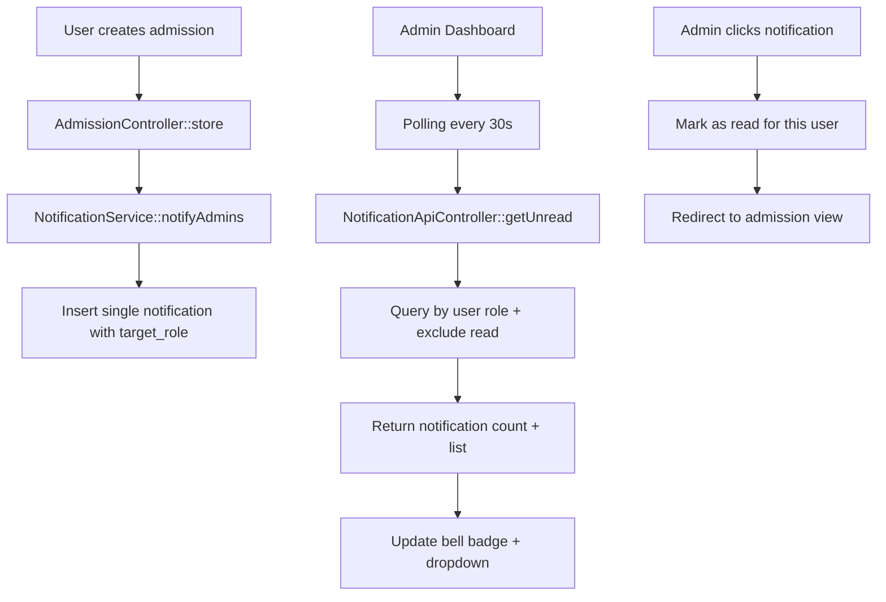

# Notification System Implementation Plan

## Overview

Implement a real-time notification system that notifies all admins (superadmin + admin roles) when a new admission is submitted by any user.

## Requirements Summary

- **Trigger**: New admission created
- **Recipients**: All users with `superadmin` or `admin` roles
- **Display**: Bell icon on dashboard topbar with real-time updates
- **Behavior**: Polling-based real-time updates (similar to existing messages feature)

## Architecture



## Database Schema

### notifications table

| Column      | Type               | Description                                               |
| ----------- | ------------------ | --------------------------------------------------------- |
| id          | INT AUTO_INCREMENT | Primary key                                               |
| target_role | VARCHAR(50)        | Target role: admin, superadmin, or \* for all             |
| type        | VARCHAR(50)        | Notification type (e.g., `new_admission`)                 |
| title       | VARCHAR(255)       | Notification title                                        |
| message     | TEXT               | Notification message                                      |
| data        | JSON               | Additional data (e.g., admission_id, registration_number) |
| created_at  | DATETIME           | Creation timestamp                                        |
| updated_at  | DATETIME           | Update timestamp                                          |

### notification_reads table

| Column          | Type               | Description                    |
| --------------- | ------------------ | ------------------------------ |
| id              | INT AUTO_INCREMENT | Primary key                    |
| notification_id | INT NOT NULL       | FK to notifications            |
| user_id         | INT NOT NULL       | User who read the notification |
| read_at         | DATETIME           | When notification was read     |

**Why this role-based approach?**

- Follows CodeIgniter Shield's role-based pattern
- Single notification record per event (not per user)
- Read status tracked separately per user
- More efficient for multi-admin notifications
- Easy to extend for other roles (finance, frontline, etc.)

## File Structure

```
app/
├── Database/
│   └── Migrations/
│       └── 2026-02-14-150000_CreateNotificationsTables.php
├── Modules/
│   └── Notification/
│       ├── Config/
│       │   └── Routes.php
│       ├── Controllers/
│       │   └── Api/
│       │       └── NotificationApiController.php
│       └── Models/
│           ├── NotificationModel.php
│           └── NotificationReadModel.php
├── Services/
│   └── NotificationService.php
```

## Implementation Steps

### Step 1: Create Database Migration

Create migration file: `app/Database/Migrations/2026-02-14-150000_CreateNotificationsTables.php`

```php
<?php

namespace App\Database\Migrations;

use CodeIgniter\Database\Migration;

class CreateNotificationsTables extends Migration
{
    public function up()
    {
        // Create notifications table
        $this->forge->addField([
            'id' => [
                'type' => 'INT',
                'constraint' => 11,
                'unsigned' => true,
                'auto_increment' => true,
            ],
            'target_role' => [
                'type' => 'VARCHAR',
                'constraint' => 50,
            ],
            'type' => [
                'type' => 'VARCHAR',
                'constraint' => 50,
            ],
            'title' => [
                'type' => 'VARCHAR',
                'constraint' => 255,
            ],
            'message' => [
                'type' => 'TEXT',
                'null' => true,
            ],
            'data' => [
                'type' => 'JSON',
                'null' => true,
            ],
            'created_at' => [
                'type' => 'DATETIME',
                'null' => true,
            ],
            'updated_at' => [
                'type' => 'DATETIME',
                'null' => true,
            ],
        ]);

        $this->forge->addKey('id', true);
        $this->forge->addKey('target_role');
        $this->forge->addKey('created_at');
        $this->forge->createTable('notifications');

        // Create notification_reads table
        $this->forge->addField([
            'id' => [
                'type' => 'INT',
                'constraint' => 11,
                'unsigned' => true,
                'auto_increment' => true,
            ],
            'notification_id' => [
                'type' => 'INT',
                'constraint' => 11,
                'unsigned' => true,
            ],
            'user_id' => [
                'type' => 'INT',
                'constraint' => 11,
                'unsigned' => true,
            ],
            'read_at' => [
                'type' => 'DATETIME',
                'null' => false,
            ],
        ]);

        $this->forge->addKey('id', true);
        $this->forge->addKey(['notification_id', 'user_id']);
        $this->forge->createTable('notification_reads');
    }

    public function down()
    {
        $this->forge->dropTable('notification_reads');
        $this->forge->dropTable('notifications');
    }
}
```

### Step 2: Create NotificationModel

Create file: `app/Modules/Notification/Models/NotificationModel.php`

Key methods:

- `getUnreadForUser(userId, userRole)` - Get unread notifications based on role, excluding already read
- `getUnreadCountForUser(userId, userRole)` - Get count of unread notifications
- `createNotification(targetRole, type, title, message, data)` - Create new notification

### Step 3: Create NotificationReadModel

Create file: `app/Modules/Notification/Models/NotificationReadModel.php`

Key methods:

- `markAsRead(notificationId, userId)` - Mark notification as read for user
- `isRead(notificationId, userId)` - Check if notification is read by user
- `markAllAsReadForUser(userId, notificationIds)` - Mark multiple as read

### Step 4: Create NotificationService

Create file: `app/Services/NotificationService.php`

```php
<?php

namespace App\Services;

use Modules\Notification\Models\NotificationModel;
use Modules\Notification\Models\NotificationReadModel;
use CodeIgniter\Shield\Models\UserModel;

class NotificationService
{
    protected NotificationModel $notificationModel;
    protected NotificationReadModel $readModel;

    public function __construct()
    {
        $this->notificationModel = new NotificationModel();
        $this->readModel = new NotificationReadModel();
    }

    /**
     * Create notification for specific role
     */
    public function createForRole(string $role, string $type, string $title, string $message, array $data = []): int
    {
        return $this->notificationModel->insert([
            'target_role' => $role,
            'type' => $type,
            'title' => $title,
            'message' => $message,
            'data' => json_encode($data),
        ]);
    }

    /**
     * Create notification for multiple roles
     */
    public function createForRoles(array $roles, string $type, string $title, string $message, array $data = []): void
    {
        foreach ($roles as $role) {
            $this->createForRole($role, $type, $title, $message, $data);
        }
    }

    /**
     * Notify all admins (superadmin + admin)
     */
    public function notifyAdmins(string $type, string $title, string $message, array $data = []): void
    {
        $this->createForRoles(['superadmin', 'admin'], $type, $title, $message, $data);
    }

    /**
     * Notify about new admission
     */
    public function notifyNewAdmission(array $admissionData): void
    {
        $this->notifyAdmins(
            'new_admission',
            'New Admission Submitted',
            "New applicant: {$admissionData['applicant_name']} for {$admissionData['program_title']}",
            [
                'admission_id' => $admissionData['admission_id'] ?? null,
                'registration_number' => $admissionData['registration_number'],
                'program_title' => $admissionData['program_title'],
                'applicant_name' => $admissionData['applicant_name'],
            ]
        );
    }

    /**
     * Get unread notifications for user
     */
    public function getUnreadForUser(int $userId, string $userRole): array
    {
        return $this->notificationModel->getUnreadForUser($userId, $userRole);
    }

    /**
     * Get unread count for user
     */
    public function getUnreadCountForUser(int $userId, string $userRole): int
    {
        return $this->notificationModel->getUnreadCountForUser($userId, $userRole);
    }

    /**
     * Mark notification as read
     */
    public function markAsRead(int $notificationId, int $userId): bool
    {
        return $this->readModel->markAsRead($notificationId, $userId);
    }

    /**
     * Mark all notifications as read for user
     */
    public function markAllAsRead(int $userId, string $userRole): bool
    {
        $notifications = $this->getUnreadForUser($userId, $userRole);
        $ids = array_column($notifications, 'id');

        if (empty($ids)) {
            return true;
        }

        return $this->readModel->markAllAsReadForUser($userId, $ids);
    }
}
```

### Step 5: Create API Controller

Create file: `app/Modules/Notification/Controllers/Api/NotificationApiController.php`

```php
<?php

namespace Modules\Notification\Controllers\Api;

use CodeIgniter\RESTful\ResourceController;
use App\Services\NotificationService;

class NotificationApiController extends ResourceController
{
    protected NotificationService $notificationService;

    public function __construct()
    {
        $this->notificationService = new NotificationService();
    }

    /**
     * Get unread notification count
     */
    public function getUnreadCount()
    {
        $user = auth()->user();
        if (!$user) {
            return $this->failUnauthorized();
        }

        $userRole = $this->getUserRole($user);
        $count = $this->notificationService->getUnreadCountForUser($user->id, $userRole);

        return $this->respond(['count' => $count]);
    }

    /**
     * Get notification list
     */
    public function getList()
    {
        $user = auth()->user();
        if (!$user) {
            return $this->failUnauthorized();
        }

        $limit = $this->request->getGet('limit') ?? 10;
        $userRole = $this->getUserRole($user);

        $notifications = $this->notificationService->getUnreadForUser($user->id, $userRole);

        return $this->respond([
            'notifications' => array_slice($notifications, 0, $limit)
        ]);
    }

    /**
     * Mark notification as read
     */
    public function markAsRead($id = null)
    {
        $user = auth()->user();
        if (!$user) {
            return $this->failUnauthorized();
        }

        if (!$id) {
            return $this->failValidationError('Notification ID required');
        }

        $result = $this->notificationService->markAsRead((int)$id, $user->id);

        return $this->respond(['success' => $result]);
    }

    /**
     * Mark all notifications as read
     */
    public function markAllAsRead()
    {
        $user = auth()->user();
        if (!$user) {
            return $this->failUnauthorized();
        }

        $userRole = $this->getUserRole($user);
        $result = $this->notificationService->markAllAsRead($user->id, $userRole);

        return $this->respond(['success' => $result]);
    }

    /**
     * Get user's primary role
     */
    protected function getUserRole($user): string
    {
        $groups = $user->getGroups();
        return $groups[0] ?? 'student';
    }
}
```

### Step 6: Create Routes

Create file: `app/Modules/Notification/Config/Routes.php`

```php
<?php

// Notification API Routes
$routes->group('notifications/api', ['namespace' => 'Modules\Notification\Controllers\Api'], function($routes) {
    $routes->get('unread-count', 'NotificationApiController::getUnreadCount');
    $routes->get('list', 'NotificationApiController::getList');
    $routes->post('mark-read/(:num)', 'NotificationApiController::markAsRead/$1');
    $routes->post('mark-all-read', 'NotificationApiController::markAllAsRead');
});
```

### Step 7: Modify AdmissionController

In `app/Modules/Admission/Controllers/AdmissionController.php`, modify the `store()` method:

After successful admission creation (around line 267), add:

```php
// Create notification for admins
$notificationService = new \App\Services\NotificationService();
$notificationService->notifyNewAdmission([
    'registration_number' => $admissionData['registration_number'],
    'admission_id' => $admissionModel->getInsertID(),
    'program_title' => $program['title'],
    'applicant_name' => $profileData['full_name'],
]);
```

### Step 8: Update Layout View

Modify `app/Modules/Dashboard/Views/layout.php`:

1. Update the bell icon dropdown (lines 508-518) to dynamically load notifications
2. Add JavaScript polling similar to the messages feature (lines 618-646)

## UI Design

### Bell Icon Badge

```html
<div class="nav-item dropdown me-3">
  <a
    class="nav-link position-relative"
    href="#"
    role="button"
    data-bs-toggle="dropdown"
  >
    <i class="bi bi-bell fs-5"></i>
    <span
      class="notification-badge"
      id="notification-badge"
      style="display: none;"
      >0</span
    >
  </a>
  <div
    class="dropdown-menu dropdown-menu-end"
    id="notification-dropdown"
    style="min-width: 320px; max-height: 400px; overflow-y: auto;"
  >
    <h6
      class="dropdown-header d-flex justify-content-between align-items-center"
    >
      <span>Notifications</span>
      <a href="#" class="text-decoration-none small" id="mark-all-read"
        >Mark all read</a
      >
    </h6>
    <div id="notification-list">
      <!-- Notifications loaded here -->
    </div>
  </div>
</div>
```

### Notification Item Template

```html
<a
  href="/admission/view/123"
  class="dropdown-item notification-item"
  data-id="1"
>
  <div class="d-flex align-items-start">
    <div class="me-2">
      <i class="bi bi-person-plus text-primary"></i>
    </div>
    <div>
      <div class="fw-medium">New Admission Submitted</div>
      <small class="text-muted">John Doe applied for English Course</small>
      <div class="text-muted small">2 minutes ago</div>
    </div>
  </div>
</a>
```

## JavaScript Implementation

```javascript
// Poll for unread notifications
document.addEventListener("DOMContentLoaded", () => {
  const updateNotificationCount = () => {
    fetch("/notifications/api/unread-count")
      .then((res) => (res.ok ? res.json() : Promise.reject("Network error")))
      .then((data) => {
        const badge = document.getElementById("notification-badge");
        if (badge) {
          if (data.count > 0) {
            badge.textContent = data.count > 99 ? "99+" : data.count;
            badge.style.display = "flex";
          } else {
            badge.style.display = "none";
          }
        }
      })
      .catch((e) => console.error("Error fetching notifications:", e));
  };

  // Initial check
  updateNotificationCount();

  // Poll every 30 seconds
  setInterval(updateNotificationCount, 30000);

  // Load notifications when dropdown opens
  const notificationDropdown = document.getElementById("notification-dropdown");
  if (notificationDropdown) {
    notificationDropdown.addEventListener("show.bs.dropdown", () => {
      loadNotifications();
    });
  }

  // Mark all as read handler
  document.getElementById("mark-all-read")?.addEventListener("click", (e) => {
    e.preventDefault();
    fetch("/notifications/api/mark-all-read", { method: "POST" }).then(() => {
      updateNotificationCount();
      loadNotifications();
    });
  });
});

function loadNotifications() {
  fetch("/notifications/api/list?limit=10")
    .then((res) => (res.ok ? res.json() : Promise.reject("Network error")))
    .then((data) => {
      const list = document.getElementById("notification-list");
      if (list && data.notifications) {
        if (data.notifications.length === 0) {
          list.innerHTML =
            '<div class="dropdown-item text-center text-muted"><small>No new notifications</small></div>';
        } else {
          list.innerHTML = data.notifications
            .map((n) => renderNotification(n))
            .join("");
        }
      }
    })
    .catch((e) => console.error("Error loading notifications:", e));
}

function renderNotification(n) {
  const timeAgo = getTimeAgo(n.created_at);
  const icon = getNotificationIcon(n.type);
  const url = getNotificationUrl(n);

  return `
        <a href="${url}" class="dropdown-item notification-item" data-id="${n.id}" onclick="markAsRead(${n.id})">
            <div class="d-flex align-items-start">
                <div class="me-2">${icon}</div>
                <div>
                    <div class="fw-medium">${escapeHtml(n.title)}</div>
                    <small class="text-muted">${escapeHtml(n.message)}</small>
                    <div class="text-muted small">${timeAgo}</div>
                </div>
            </div>
        </a>
    `;
}

function markAsRead(id) {
  fetch(`/notifications/api/mark-read/${id}`, { method: "POST" });
}

function getNotificationIcon(type) {
  const icons = {
    new_admission: '<i class="bi bi-person-plus text-primary"></i>',
  };
  return icons[type] || '<i class="bi bi-bell text-secondary"></i>';
}

function getNotificationUrl(n) {
  if (n.type === "new_admission" && n.data?.registration_number) {
    return `/admission/view/${n.data.admission_id}`;
  }
  return "#";
}

function getTimeAgo(dateString) {
  const date = new Date(dateString);
  const now = new Date();
  const seconds = Math.floor((now - date) / 1000);

  if (seconds < 60) return "Just now";
  if (seconds < 3600) return Math.floor(seconds / 60) + " minutes ago";
  if (seconds < 86400) return Math.floor(seconds / 3600) + " hours ago";
  return Math.floor(seconds / 86400) + " days ago";
}

function escapeHtml(text) {
  const div = document.createElement("div");
  div.textContent = text;
  return div.innerHTML;
}
```

## Security Considerations

1. **Authentication**: All API endpoints require authentication
2. **Authorization**: Users only see notifications for their role
3. **CSRF Protection**: POST endpoints use CSRF validation (handled by CI4)
4. **Input Validation**: All inputs validated before processing

## Performance Considerations

1. **Indexing**: Database indexes on `target_role`, `created_at`, and composite key on `notification_id, user_id`
2. **Pagination**: Notification list limited to 10 items initially
3. **Polling Interval**: 30-second interval to balance real-time feel with server load
4. **Cleanup**: Consider adding a scheduled task to delete old notifications (e.g., older than 30 days)

## Testing Checklist

- [ ] Run migration to create notifications and notification_reads tables
- [ ] Create test admission and verify notification is created
- [ ] Verify notification appears for admin users
- [ ] Verify notification does NOT appear for non-admin users
- [ ] Test mark as read functionality
- [ ] Test mark all as read functionality
- [ ] Test real-time polling updates
- [ ] Test notification link redirects to correct admission

## Estimated Files to Create/Modify

| File                                                                      | Action |
| ------------------------------------------------------------------------- | ------ |
| `app/Database/Migrations/2026-02-14-150000_CreateNotificationsTables.php` | Create |
| `app/Modules/Notification/Config/Routes.php`                              | Create |
| `app/Modules/Notification/Models/NotificationModel.php`                   | Create |
| `app/Modules/Notification/Models/NotificationReadModel.php`               | Create |
| `app/Modules/Notification/Controllers/Api/NotificationApiController.php`  | Create |
| `app/Services/NotificationService.php`                                    | Create |
| `app/Modules/Admission/Controllers/AdmissionController.php`               | Modify |
| `app/Modules/Dashboard/Views/layout.php`                                  | Modify |
